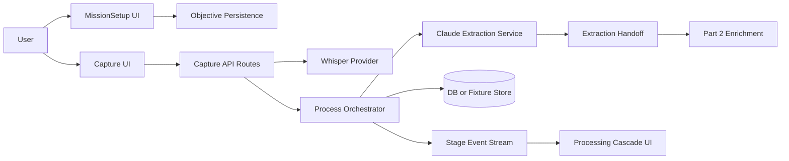
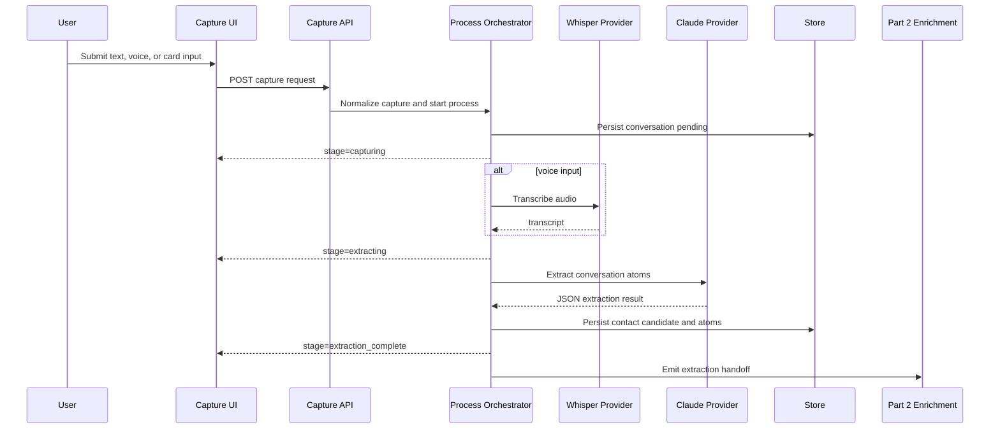

# AfterMeet Intelligence Layer Part 1 - Capture and Extraction SDD

## 1. Introduction

### Purpose

This document defines the independent implementation scope for the Capture and Extraction workstream of the AfterMeet intelligence layer. It turns a user's event objective and raw conversation input into a typed, persisted, source-aware extraction handoff that downstream enrichment and decisioning workstreams can consume.

### Intended Audience

- Engineer owning objective setup, capture screens, capture API routes, transcription, and LLM extraction.
- Engineer integrating the Part 2 enrichment handoff.
- Reviewer validating privacy, typing, demo fallback, and test coverage.

### Scope

Included:

- Project foundation required by this workstream.
- Core domain types used at the pipeline boundary.
- User objective setup and mission mode.
- Text capture, voice transcription, and card capture shell.
- Synchronous process orchestration with streamed stage updates.
- Claude-based conversation atom extraction.
- Persistence for users, objectives, conversations, and conversation atoms.
- Demo fallback fixtures for objective, capture, transcription, and extraction.

Excluded:

- Public context enrichment, Cala, Gemini web fallback, source confidence, and fact confidence. See Part 2.
- Opportunity routing, action policy, drafts, decision trace, follow-up board, traction, and feedback learning. See Part 3.
- Production multi-tenant RLS. The MVP is single-tenant demo mode, with production RLS deferred.

### Definitions

| Term | Meaning |
| --- | --- |
| Objective profile | The user's role, goals, constraints, event context, tone, and attention budget. |
| Capture | Raw user-created input from text, voice note, or business card photo. |
| Conversation atoms | Structured facts, asks, offers, commitments, uncertainties, and sentiment extracted from raw conversation text. |
| Extraction handoff | The typed contract emitted by Part 1 and consumed by Part 2. |
| Stage event | A streamed progress event emitted by the process route for the cascade UI. |

### References

- Source spec: `docs/intelligence-layer-specs.md`
- Parallel ownership map: `docs/intelligence-layer-parallel-work-ownership.md`
- Shared contracts: `lib/types/index.ts`
- Covered source sections: Project Summary, Product Philosophy, User Objective Model, Core Domain Model, Database Schema 6.1-6.5, Architecture ADR-001, ADR-002, File Structure, Pipeline steps 1-3, Phases 0-4, Phase 24.1-24.3, Phase 25, Phase 26 extraction tests.

### Parallel Work Ownership

Part 1 owns capture, objective setup, transcription, extraction, and the process route shell. It must produce `ExtractionHandoff` from `lib/types/handoffs.ts` and should not implement enrichment, scoring, action policy, or draft generation.

Owned implementation paths:

```text
app/capture/*
app/api/capture/*
app/api/intelligence/process/route.ts
components/MissionSetup.tsx
components/CaptureCard.tsx
components/VoiceCapture.tsx
components/CardScan.tsx
lib/intelligence/extraction.ts
lib/providers/whisper.ts
```

Shared-with-care paths:

```text
lib/types/*
lib/providers/claude.ts
```

Contract rules:

- Import shared types from `lib/types/index.ts`.
- Keep changes to `ExtractionHandoff` additive unless Part 2 agrees.
- Part 2 should expose `enrichEvidence(...)`; Part 1 calls that service from the process route instead of editing Part 2 files.
- Part 3 should expose `recommendNextAction(...)`; Part 1 calls that service from the process route instead of editing Part 3 files.
- Database work in this stream should be limited to `users`, `user_objectives`, `contacts`, `conversations`, and `conversation_atoms`.

## 2. System Overview

### Context

At a high-density networking event, the user first sets what they are trying to achieve. They then capture a conversation as text, voice, or card-assisted input. The server normalizes the capture into a conversation record, extracts structured professional information, and emits a handoff for enrichment.

### Users

- Primary user: event attendee using AfterMeet after or during conversations.
- Internal consumers: Part 2 enrichment services and Part 3 decisioning services.

### High-Level Architecture



### Key Components

| Component | Responsibility |
| --- | --- |
| `MissionSetup.tsx` | Creates and updates `UserObjectiveProfile`. |
| `CaptureCard.tsx`, `VoiceCapture.tsx`, `CardScan.tsx` | Collect user-created capture input and show acceptable-use nudge. |
| `/api/capture/text` | Validates text capture and starts processing. |
| `/api/capture/voice` | Accepts audio, transcribes server-side, starts processing. |
| `/api/capture/card` | Accepts card image metadata or OCR fallback, starts processing. |
| `/api/intelligence/process` | Synchronous orchestrator that streams stage events and emits the extraction handoff. |
| `lib/providers/whisper.ts` | Server-only OpenAI audio transcription provider. |
| `lib/providers/claude.ts` | Server-only Claude JSON extraction provider wrapper. |
| `lib/intelligence/extraction.ts` | Prompting, parsing, validation, and fallback for conversation atoms. |
| `lib/demo/fixtures.ts` | Saved extraction and transcription examples for demo reliability. |

### External Integrations

| System | Used For | Boundary |
| --- | --- | --- |
| OpenAI transcription API | Voice note to text | Server-only provider, never called from browser. |
| Claude API | Conversation atom extraction | Server-only provider, JSON-only response contract. |
| Supabase/Postgres or local fixture store | Persistence | Repository layer hides storage choice from UI. |

## 3. Design Considerations

### Assumptions

- Text capture is the MVP primary path.
- Voice capture is a short dictated memo, not live streaming.
- Card capture may be a shell or text fallback in MVP.
- The user records their own summary after a conversation.
- The pipeline can run synchronously for demo scope when each external hop has a timeout and fallback.

### Constraints

- No API keys may be exposed to the frontend.
- No draft generation happens in Part 1.
- No public enrichment happens in Part 1.
- Do not store sensitive personal details unless explicitly present, professional, and necessary.
- Uncertain extraction output must stay in `uncertainties`, not promoted to facts.
- Every capture belongs to a real met contact or a conversation the user created.

### Dependencies

| Dependency | Purpose | Notes |
| --- | --- | --- |
| TypeScript | Shared contracts | All handoffs must be typed. |
| React | Capture and mission UI | Framework can be Next.js App Router or Vite plus API server. |
| Tailwind | UI styling | Use existing project convention once app exists. |
| OpenAI API key | Voice transcription | Optional in demo mode. |
| Anthropic API key | Extraction | Optional in demo mode with fixtures. |
| Supabase/Postgres | Persistence | Local JSON is acceptable for time-boxed MVP if repository-shaped. |

### Risks and Mitigations

| Risk | Impact | Mitigation |
| --- | --- | --- |
| LLM returns invalid JSON | Pipeline break | Strict JSON parsing, schema validation, retry once, then safe fixture/error result. |
| Voice transcription fails | User blocked | Fall back to text capture and preserve audio error state. |
| Capture contains sensitive details | Privacy violation | Prompt extraction to filter sensitive non-professional content; store uncertainty/warning. |
| Slow external APIs | Dead UI | Stream stage events and timeout each external call. |
| Objective missing | Scoring later becomes generic | Require objective before processing or use explicit demo objective fixture. |

## 4. Architectural Strategies

### Selected Strategy

Use thin capture routes that normalize input and delegate to one process orchestrator. The orchestrator persists the conversation, calls extraction, streams stage updates, and emits a single typed extraction handoff.

### Rationale

- Keeps capture input concerns separate from intelligence logic.
- Makes the cascade UI real because every stage has an event.
- Gives Part 2 a stable handoff even if storage changes from local fixtures to Postgres.
- Allows demo fallback without pretending fixture data is live.

### Alternatives Considered

| Alternative | Why Not Selected |
| --- | --- |
| Client-side extraction | Exposes keys, leaks prompt logic, weak privacy boundary. |
| Background queue for all processing | More infrastructure than the MVP needs. |
| Route-specific pipelines per capture type | Duplicates extraction and makes downstream handoff inconsistent. |
| Generate drafts directly after extraction | Violates evidence-before-output product philosophy. |

### Key Decisions

- Text capture ships first; voice and card may fall back to text in demo.
- OpenAI transcription is used for voice, not real-time voice-agent infrastructure.
- The process route streams stage events by HTTP streaming, SSE, or equivalent framework primitive.
- Extraction output is schema-validated before persistence.
- The handoff contains uncertainty and extraction confidence; downstream workstreams decide what can influence scoring or drafts.

## 5. System Architecture

### Data Flow



### API Contracts

#### POST `/api/capture/text`

Request:

```ts
interface TextCaptureRequest {
  userId: string;
  rawText: string;
  eventContext?: string;
  capturedAt?: string;
}
```

Success 202:

```ts
interface CaptureAcceptedResponse {
  requestId: string;
  conversationId: string;
  status: "captured" | "processing";
  streamUrl?: string;
}
```

Errors:

| Status | Code | Meaning |
| --- | --- | --- |
| 400 | `VALIDATION_ERROR` | `rawText` is empty or too long. |
| 401 | `UNAUTHORIZED` | User session is missing once auth exists. |
| 422 | `OBJECTIVE_REQUIRED` | No active objective is available. |
| 500 | `CAPTURE_FAILED` | Unexpected persistence or orchestration failure. |

#### POST `/api/capture/voice`

Request:

```ts
interface VoiceCaptureRequest {
  userId: string;
  audioFile: File;
  eventContext?: string;
  capturedAt?: string;
}
```

Success 202:

```ts
interface VoiceCaptureAcceptedResponse extends CaptureAcceptedResponse {
  transcriptStatus: "pending" | "completed" | "fallback_required";
}
```

Errors:

| Status | Code | Meaning |
| --- | --- | --- |
| 400 | `UNSUPPORTED_AUDIO` | File type or size is unsupported. |
| 422 | `TRANSCRIPTION_UNAVAILABLE` | User must use text fallback. |
| 500 | `VOICE_CAPTURE_FAILED` | Unexpected failure. |

#### POST `/api/capture/card`

Request:

```ts
interface CardCaptureRequest {
  userId: string;
  imageFile?: File;
  manualTextFallback?: string;
  eventContext?: string;
}
```

Success 202:

```ts
interface CardCaptureAcceptedResponse extends CaptureAcceptedResponse {
  cardStatus: "captured" | "manual_fallback";
}
```

Errors:

| Status | Code | Meaning |
| --- | --- | --- |
| 400 | `CARD_INPUT_REQUIRED` | Neither image nor manual fallback was provided. |
| 422 | `CARD_FALLBACK_REQUIRED` | Card processing is disabled in demo mode. |
| 500 | `CARD_CAPTURE_FAILED` | Unexpected failure. |

#### POST `/api/intelligence/process`

This endpoint can be called internally by capture routes or directly by the UI when the framework favors a single streaming route.

Request:

```ts
interface ProcessConversationRequest {
  requestId: string;
  userId: string;
  conversationId?: string;
  captureType: "text" | "voice" | "card";
  rawText?: string;
  transcript?: string;
  cardText?: string;
  eventContext?: string;
}
```

Stream events:

```ts
type ProcessStage =
  | "capturing"
  | "transcribing"
  | "extracting"
  | "persisting_atoms"
  | "handoff_ready"
  | "failed";

interface ProcessStageEvent {
  requestId: string;
  conversationId?: string;
  stage: ProcessStage;
  status: "started" | "completed" | "fallback" | "failed";
  message?: string;
  payload?: unknown;
  timestamp: string;
}
```

Final event payload:

```ts
interface ExtractionHandoff {
  requestId: string;
  userId: string;
  objective: UserObjectiveProfile;
  conversation: Conversation;
  contactCandidate: ContactCandidate;
  atoms: ConversationAtoms;
  opportunityHints: OpportunityHint[];
  extraction: {
    provider: "claude" | "fixture";
    model?: string;
    extractionConfidence: number;
    warnings: string[];
  };
  sourceRecord: {
    provider: "conversation";
    sourceType: "user_voice_note" | "business_card" | "manual";
    retrievedAt: string;
    sourceConfidence: number;
  };
}
```

### Data Models

#### `UserObjectiveProfile`

```ts
interface UserObjectiveProfile {
  id: string;                         // UUID, PK
  userId: string;                     // UUID, FK users.id, indexed
  role: UserRole;                     // enum, not null
  activeGoals: UserGoal[];            // text[], default []
  primaryGoal: UserGoal;              // enum, not null
  secondaryGoals: UserGoal[];         // text[], default []
  eventContext?: string | null;       // nullable
  companyName?: string | null;        // nullable
  companyStage?: string | null;       // nullable
  productDescription?: string | null; // nullable
  targetCustomer?: string | null;     // nullable
  currentTraction?: string | null;    // nullable
  fundraisingStatus?: string | null;  // nullable
  hiringNeeds?: string[];             // text[], default []
  attentionBudgetToday: number;       // integer, default 5, min 0
  preferredTone: "direct" | "warm" | "formal" | "casual" | "concise";
  constraints: string[];              // text[], default []
  createdAt: string;                  // timestamp, indexed
  updatedAt: string;                  // timestamp
}
```

Indexes:

- `user_objectives_user_id_idx` on `user_id`.
- `user_objectives_user_updated_idx` on `(user_id, updated_at DESC)`.

#### `Conversation`

```ts
interface Conversation {
  id: string;                         // UUID, PK
  userId: string;                     // UUID, FK users.id, indexed
  contactId?: string | null;          // UUID, FK contacts.id, nullable until resolution
  rawText: string;                    // text, not null after normalization
  captureType: "voice" | "text" | "card";
  transcript?: string | null;         // nullable
  eventContext?: string | null;       // nullable
  capturedAt: string;                 // timestamp, indexed
  processingStatus: "pending" | "processing" | "extracted" | "failed";
}
```

Indexes:

- `conversations_user_captured_idx` on `(user_id, captured_at DESC)`.
- `conversations_status_idx` on `processing_status`.

#### `ConversationAtoms`

```ts
interface ConversationAtoms {
  facts: AtomFact[];                  // JSONB, default []
  asks: AtomAsk[];                    // JSONB, default []
  offers: AtomOffer[];                // JSONB, default []
  commitments: AtomCommitment[];      // JSONB, default []
  uncertainties: string[];            // JSONB or text[], default []
  sentiment?: string | null;          // nullable
  extractionConfidence: number;       // numeric 0..1, indexed if stored separately
}
```

#### `ContactCandidate`

```ts
interface ContactCandidate {
  name?: string | null;
  role?: string | null;
  company?: string | null;
  email?: string | null;
  phone?: string | null;
  website?: string | null;
  linkedinUrl?: string | null;
}
```

#### `OpportunityHint`

```ts
interface OpportunityHint {
  route: OpportunityType;
  score: number;                      // numeric 0..1
  evidence: string[];
}
```

### Owned Tables

Part 1 owns schema creation or repository coverage for:

- `users`
- `user_objectives`
- `conversations`
- `conversation_atoms`

Part 1 may create a minimal `contacts` row when a contact candidate is strong enough, but Part 2 owns entity resolution confidence and public context.

## 6. Policies and Tactics

### Authentication and Authorization

- MVP may use a seeded demo user.
- All server routes require a `userId` that maps to the demo user or authenticated session.
- Production must replace demo user trust with Supabase Auth and RLS before real use.

### Data Protection and Privacy

- Show acceptable-use text on capture: "Record your own summary after the conversation. Do not record others without their knowledge."
- Do not send audio, card images, or raw text to any client-side third-party SDK.
- Extraction prompt must reject sensitive non-professional information.
- Store only the normalized transcript/text required for the relationship memory.
- Provide delete hooks in repository shape even if UI delete is completed in Part 3.

### Error Handling and Retry

- Provider calls use typed errors and timeouts.
- Claude extraction retries once only for parse or schema failures.
- If extraction fails in demo mode, return a fixture labeled `Demo data`.
- If extraction fails in live mode, mark conversation `failed` and preserve raw text for retry.

### Logging, Metrics, Tracing, Alerting

Log with request IDs:

- Capture type and payload size, never full raw text by default.
- Stage start/completion/failure.
- Provider latency and timeout count.
- Extraction parse failures.
- Fallback usage and fixture label.

Metrics:

- Capture success rate by type.
- Extraction success rate.
- Median process duration.
- Time to first stage event.

### Performance and Scaling

- Enforce max raw text length for MVP, for example 8,000 characters.
- Enforce audio file size and duration limits.
- Stream a first stage event immediately before provider work.
- Keep extraction prompts compact and JSON-only.
- Persist before external calls so retry can resume from the conversation record.

## 7. Detailed Design

### 7.1 Mission Setup Design

#### Responsibilities

- Collect role, primary goal, secondary goals, event context, tone, attention budget, and constraints.
- Persist one active objective profile per user.
- Display the active mode on the dashboard.

#### Interface

```ts
async function saveUserObjective(input: UserObjectiveProfileInput): Promise<UserObjectiveProfile>;
async function getActiveObjective(userId: string): Promise<UserObjectiveProfile | null>;
```

#### Dependencies

- User objective repository.
- Shared `UserRole`, `UserGoal`, and tone enums.

#### State Management

- Local form state in the UI.
- Persisted objective row with `updatedAt` changes.

#### Error Handling

- Missing primary goal returns `VALIDATION_ERROR`.
- Missing objective during capture returns `OBJECTIVE_REQUIRED`.

#### Verification

- Unit test enum validation.
- Integration test saving and retrieving active objective.
- Manual test changing objective affects the handoff objective payload.

### 7.2 Capture API Design

#### Responsibilities

- Validate capture input.
- Normalize raw text or transcript.
- Create conversation record.
- Invoke process orchestration.
- Return accepted status and stream location.

#### Interface

```ts
async function createCapture(input: {
  userId: string;
  captureType: "text" | "voice" | "card";
  rawText?: string;
  audioFile?: File;
  cardText?: string;
  eventContext?: string;
}): Promise<CaptureAcceptedResponse>;
```

#### Dependencies

- Objective repository.
- Conversation repository.
- Process orchestrator.
- Whisper provider for voice.

#### State Management

- Conversation starts as `pending`, moves to `processing`, then `extracted` or `failed`.

#### Error Handling

- Validation errors return 400.
- Objective missing returns 422.
- Provider timeout returns a fallback event and keeps the conversation retryable.

#### Verification

- Integration tests for text capture happy path and missing raw text.
- Manual test voice fallback to text when `OPENAI_API_KEY` is missing.

### 7.3 Transcription Provider Design

#### Responsibilities

- Send short audio file to OpenAI transcription API.
- Return transcript text and provider metadata.
- Never run from the browser.

#### Interface

```ts
interface TranscriptionResult {
  transcript: string;
  provider: "openai" | "fixture";
  model?: string;
  durationMs: number;
  warnings: string[];
}

async function transcribeVoiceNote(input: {
  audioFile: File | Blob;
  languageHint?: string;
}): Promise<TranscriptionResult>;
```

#### Error Handling

- Unsupported file type returns `UNSUPPORTED_AUDIO`.
- Provider timeout returns `TRANSCRIPTION_UNAVAILABLE`.
- Demo mode returns fixture with `provider: "fixture"`.

#### Verification

- Provider wrapper test with mocked response.
- Timeout test.
- Demo fixture test.

### 7.4 Extraction Service Design

#### Responsibilities

- Build Claude prompt with objective and conversation text.
- Request JSON only.
- Validate extraction against schema.
- Separate facts from uncertainties.
- Return opportunity hints without choosing an action.

#### Interface

```ts
async function extractConversationAtoms(input: {
  rawText: string;
  userObjective: UserObjectiveProfile;
}): Promise<ConversationAtomsExtractionResult>;

interface ConversationAtomsExtractionResult {
  contactCandidate: ContactCandidate;
  atoms: ConversationAtoms;
  opportunityHints: OpportunityHint[];
}
```

#### Dependencies

- Claude provider wrapper.
- Extraction schema validator.
- Demo fixture loader.

#### Error Handling

- Invalid JSON retries once with a repair prompt or stricter JSON instruction.
- Schema failure returns a safe extraction with low confidence and warning.
- Sensitive details are dropped or moved into warnings.

#### Implementation Notes

- The system prompt must include: "Do not write a follow-up message yet."
- The service must not call Part 2 or Part 3 logic directly.
- The `extractionConfidence` score is a signal only; Part 2 computes confidence from multiple factors.

#### Verification

- Unit tests for messy input, partial contact names, commitments, asks, and uncertain company names.
- Snapshot test for the demo narrative input.
- Test that no draft text appears in extraction output.

### 7.5 Process Orchestrator Design

#### Responsibilities

- Run capture normalization, transcription when needed, extraction, persistence, and handoff creation.
- Stream stage events to the UI.
- Timeout each provider call and use typed fallback.

#### Interface

```ts
async function processConversation(input: ProcessConversationRequest): Promise<ExtractionHandoff>;
```

#### Dependencies

- Conversation repository.
- Objective repository.
- Transcription provider.
- Extraction service.
- Stage event emitter.

#### State Management

- Emits ephemeral stage events.
- Persists durable conversation and conversation atoms.
- Final handoff can be returned in-stream and stored for Part 2 invocation.

#### Error Handling

- A failed external hop must emit a `fallback` or `failed` event.
- Deterministic persistence errors fail the request and mark conversation `failed`.

#### Verification

- Integration test stage event order.
- Timeout test for transcription and extraction.
- Test final handoff shape matches Part 2 contract.

## 8. Appendix

### Requirement Traceability

| Requirement | Design Component | Verification |
| --- | --- | --- |
| P1-REQ-001 User can set an objective profile. | Mission Setup, objective repository | Unit and integration tests |
| P1-REQ-002 User can submit text capture. | `/api/capture/text`, Capture UI | Integration and manual test |
| P1-REQ-003 Voice capture uses server-side transcription. | `/api/capture/voice`, `whisper.ts` | Provider mock and fallback test |
| P1-REQ-004 Capture creates a conversation record. | Conversation repository | Integration test |
| P1-REQ-005 Process route streams stage events. | Process orchestrator | Integration test checking event order |
| P1-REQ-006 Extraction returns valid typed JSON. | `extraction.ts` | Unit tests and schema validation |
| P1-REQ-007 Extraction never generates drafts. | Claude prompt, output schema | Unit test excludes draft fields |
| P1-REQ-008 Uncertain details stay uncertain. | Extraction schema and parser | Messy input unit tests |
| P1-REQ-009 Demo mode works without live keys. | Fixture loader | Env-based integration test |
| P1-REQ-010 No provider key is exposed to browser. | Server-only provider modules | Static import review and build check |

### Handoff to Part 2

Part 1 is complete when it can reliably produce this object:

```ts
interface ExtractionHandoff {
  requestId: string;
  userId: string;
  objective: UserObjectiveProfile;
  conversation: Conversation;
  contactCandidate: ContactCandidate;
  atoms: ConversationAtoms;
  opportunityHints: OpportunityHint[];
  extraction: {
    provider: "claude" | "fixture";
    model?: string;
    extractionConfidence: number;
    warnings: string[];
  };
  sourceRecord: {
    provider: "conversation";
    sourceType: "user_voice_note" | "business_card" | "manual";
    retrievedAt: string;
    sourceConfidence: number;
  };
}
```

### Deferred Decisions

- Exact storage implementation if Supabase is unavailable during the hackathon.
- Card OCR provider or whether card capture remains manual text fallback for MVP.
- Whether the stage stream uses SSE, fetch streaming, or database realtime events.

### Quality Checklist

- Objective, capture, conversation, and atoms models have types, nullability, indexes, and defaults.
- Capture APIs include success and error responses.
- Privacy and acceptable-use behavior is explicit.
- Error and fallback behavior is typed.
- The Part 2 handoff is stable and does not depend on UI state.
- Original source spec remains unchanged.
