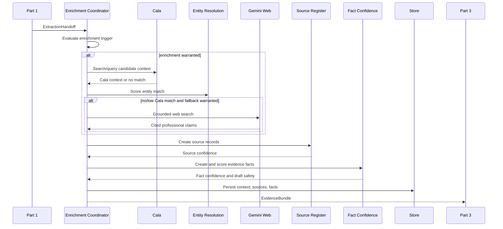

# AfterMeet Intelligence Layer Part 2 - Enrichment and Evidence SDD

## 1. Introduction

### Purpose

This document defines the independent implementation scope for the Enrichment and Evidence workstream of the AfterMeet intelligence layer. It consumes the Part 1 extraction handoff, retrieves professional public context only when appropriate, records provenance, resolves entity confidence, and computes fact confidence for downstream decisioning.

### Intended Audience

- Engineer owning Cala integration, Gemini grounded web fallback, source records, entity resolution, and fact confidence.
- Engineer integrating the evidence bundle with Part 3 scoring and decisioning.
- Frontend engineer consuming Part 2 evidence and source data for source register and confidence visuals. See Part 4.
- Reviewer validating privacy, source attribution, confidence logic, and fallback behavior.

### Scope

Included:

- Enrichment coordinator and provider cascade.
- Cala company, investor, fund, and market context integration.
- Gemini grounded web search fallback when Cala has no or low-confidence match.
- Source record creation and deterministic source confidence.
- Entity match confidence.
- Evidence fact creation and deterministic fact confidence.
- Persistence for public context, source records, and evidence facts.
- Source register and confidence display data for Part 4 screens.

Excluded:

- Conversation capture and LLM extraction. See Part 1.
- Opportunity routing, action selection, draft generation, board, terminal, outcomes, and feedback learning. See Part 3.
- User-visible source register and confidence components. See Part 4.
- Bulk people discovery, event attendee scraping, LinkedIn scraping, or marketplace features. These are explicitly out of scope.

### Definitions

| Term | Meaning |
| --- | --- |
| Extraction handoff | Part 1 output containing objective, conversation, contact candidate, atoms, and opportunity hints. |
| Public entity context | Professional public context associated with a company, fund, investor, or person/company candidate. |
| Source record | A durable provenance record for where a fact came from. |
| Evidence fact | A normalized fact with confidence inputs and draft-safety metadata. |
| Entity match confidence | Deterministic score estimating whether retrieved context matches the captured contact/company. |
| Fact confidence | Deterministic score combining source, match, extraction, freshness, and contradiction penalty. |
| Evidence bundle | Part 2 output consumed by Part 3. |

### References

- Source spec: `docs/intelligence-layer-specs.md`
- Parallel ownership map: `docs/intelligence-layer-parallel-work-ownership.md`
- Frontend visualization SDD: `docs/intelligence-layer-part-4-frontend-visualization-sdd.md`
- Shared contracts: `lib/types/index.ts`
- Covered source sections: Product Philosophy 2.4-2.5, Database Schema 6.6-6.8, ADR-003, Hard Rules, Pipeline steps 4-8, Phases 5-8, Phase 23 privacy guardrails, Phase 25 demo fallback, Phase 26 confidence tests.

### Parallel Work Ownership

Part 2 owns enrichment, source provenance, entity resolution, and confidence scoring. It consumes `ExtractionHandoff` and produces `EvidenceBundle` from `lib/types/handoffs.ts`; it should not edit capture routes, the process route shell, frontend components, action policy, board UI, or draft generation.

Owned implementation paths:

```text
app/api/enrich/cala/route.ts
app/api/enrich/web/route.ts
lib/intelligence/enrichment.ts
lib/intelligence/sourceConfidence.ts
lib/intelligence/entityResolution.ts
lib/intelligence/factConfidence.ts
lib/providers/cala.ts
lib/providers/gemini.ts
```

Shared-with-care paths:

```text
lib/types/*
```

Contract rules:

- Import shared types from `lib/types/index.ts`.
- Keep changes to `EvidenceBundle` additive unless Part 3 agrees.
- Part 4 owns source register and confidence UI; Part 2 provides source and confidence data only.
- Do not call Part 3 decisioning from enrichment; return the evidence bundle only.
- Do not call capture or extraction implementation files directly; use the `ExtractionHandoff` contract.
- Database work in this stream should be limited to `public_entity_context`, `source_records`, and `evidence_facts`.

## 2. System Overview

### Context

After extraction, the system may need public professional context to understand whether a contact is a potential user, investor, partner, candidate, mentor, customer, or sponsor. This workstream enriches only contacts the user actually met, records every source, computes confidence deterministically, and returns a safe evidence bundle.

### Users

- Internal consumer: Part 3 decision engine.
- Human user: indirectly sees source register, confidence breakdowns, and "public context unavailable" states.

### High-Level Architecture

```mermaid
flowchart LR
  P1[Part 1 Extraction Handoff] --> Coordinator[Enrichment Coordinator]
  Coordinator --> Trigger[Enrichment Trigger Policy]
  Trigger --> Cala[Cala Provider]
  Cala --> Match[Entity Resolution]
  Match -->|no or low match| Gemini[Gemini Web Fallback]
  Match --> Source[Source Register]
  Gemini --> Source
  Source --> Facts[Evidence Fact Builder]
  Facts --> Confidence[Fact Confidence]
  Confidence --> Bundle[Evidence Bundle]
  Bundle --> P3[Part 3 Decisioning]
```



### Key Components

| Component | Responsibility |
| --- | --- |
| `lib/intelligence/enrichment.ts` | Owns enrichment cascade, trigger policy, and evidence bundle assembly. |
| `lib/providers/cala.ts` | Server-only Cala search, query, entity search, and entity retrieval wrapper. |
| `app/api/enrich/cala/route.ts` | Server route for Cala enrichment when exposed outside the orchestrator. |
| `lib/providers/gemini.ts` | Server-only Gemini grounded search wrapper. |
| `app/api/enrich/web/route.ts` | Server route for web fallback when exposed outside the orchestrator. |
| `lib/intelligence/sourceConfidence.ts` | Source priors and deterministic source confidence. |
| `lib/intelligence/entityResolution.ts` | Captured candidate to retrieved candidate match scoring. |
| `lib/intelligence/factConfidence.ts` | Deterministic fact confidence and draft-safety thresholds. |
| `SourceRegister.tsx` data contract | UI-ready source provenance and confidence breakdown data. |

### External Integrations

| System | Used For | Boundary |
| --- | --- | --- |
| Cala | Structured, verified company/fund/investor context | Server-only, tried before web fallback. |
| Gemini with Google Search grounding | Public professional fallback context | Server-only, fallback-only, cited claims required. |
| Supabase/Postgres or local fixture store | Persist context, sources, facts | Repository layer hides storage choice. |

## 3. Design Considerations

### Assumptions

- Cala is strongest for company, fund, financial, regulatory, and market facts.
- Cala is not expected to identify arbitrary private persons.
- Gemini web fallback is lower confidence than Cala and must be citation-backed.
- Enrichment is not required for every contact.
- The system can continue without public context.

### Constraints

- Enrich only people the user actually met.
- Do not scrape LinkedIn.
- Do not crawl, paginate, or harvest profiles.
- Web search is a query through a search-enabled API, not a scraper.
- Web fallback runs only after Cala has no match or a match below the medium threshold.
- Every web-derived fact must carry a citation URL.
- No citation means the claim is discarded.
- Public context must be professional and relevant.
- Low entity confidence blocks draft use of enriched facts.
- If neither Cala nor web fallback yields data, return "public context unavailable" and do not invent.

### Dependencies

| Dependency | Purpose | Notes |
| --- | --- | --- |
| `CALA_API_KEY` | Cala provider | Optional in demo mode. |
| `GEMINI_API_KEY` | Grounded search fallback | Optional; if absent, skip web fallback. |
| TypeScript | Shared contracts | Evidence bundle must be typed. |
| Postgres/Supabase or fixture repository | Persistence | Must store source and fact provenance. |

### Risks and Mitigations

| Risk | Impact | Mitigation |
| --- | --- | --- |
| Wrong entity matched | Bad recommendations and unsafe drafts | Deterministic entity match score, confirmation requirement for low/medium matches. |
| Web result contains personal data | Privacy violation | Prompt filters, professional-only schema, discard sensitive content. |
| Web facts lack source URLs | Unverifiable claims | Drop claim and log `SOURCE_REQUIRED`. |
| Cala unavailable | No enrichment | Continue with conversation-only facts and mark context unavailable. |
| LLM overstates confidence | Bad trust model | LLM confidence is not accepted as final; deterministic formula computes confidence. |
| Enrichment slows pipeline | Poor demo UX | Trigger only when useful; timeout and fallback to unavailable. |

## 4. Architectural Strategies

### Selected Strategy

Use a single enrichment coordinator that owns the ordered provider cascade:

1. Evaluate whether enrichment is warranted.
2. Try Cala first for structured context.
3. Compute entity match confidence.
4. If Cala has no match or low confidence and the contact warrants enrichment, call Gemini grounded web fallback.
5. Convert provider outputs into source records and evidence facts.
6. Compute source confidence, entity confidence, and fact confidence.
7. Emit an evidence bundle.

### Rationale

- Keeps provider order consistent across the app.
- Prevents accidental web search before Cala.
- Gives Part 3 one stable evidence contract.
- Makes confidence explainable and testable.

### Alternatives Considered

| Alternative | Why Not Selected |
| --- | --- |
| Call all providers for every contact | Expensive, slow, privacy-heavy, and inconsistent with "less follow-up, better follow-up." |
| Let the LLM decide confidence | Violates "confidence is computed, not believed." |
| Store provider summaries without source records | Breaks evidence traceability and draft-safety checks. |
| Use web search as primary enrichment | Increases hallucination and privacy risk. |

### Key Decisions

- Cala is always attempted before web fallback when enrichment is warranted.
- Gemini fallback is lower confidence by design.
- Every evidence fact is source-backed or explicitly low confidence.
- Source priors are deterministic and unit tested.
- Draft-safety is represented on facts, but Part 3 enforces final draft permissions.

## 5. System Architecture

### Data Flow



### Public Service Contract

Part 2 should expose one primary service for pipeline use:

```ts
async function enrichEvidence(input: ExtractionHandoff): Promise<EvidenceBundle>;
```

`/api/enrich/cala` and `/api/enrich/web` may exist for explicit route testing or admin/debug use, but application code should prefer `enrichEvidence` so provider order is never bypassed.

### API Contracts

#### POST `/api/enrich/cala`

Request:

```ts
interface CalaEnrichmentRequest {
  userId: string;
  contactId?: string;
  conversationId: string;
  name?: string;
  company?: string;
  role?: string;
  query?: string;
}
```

Success 200:

```ts
interface CalaEnrichmentResponse {
  available: boolean;
  candidates: CalaEntityCandidate[];
  selectedContext?: PublicEntityContext;
  entityMatchConfidence: number;
  sourceRecords: SourceRecord[];
  warnings: string[];
}
```

Errors:

| Status | Code | Meaning |
| --- | --- | --- |
| 400 | `VALIDATION_ERROR` | Candidate or query input is missing. |
| 401 | `UNAUTHORIZED` | User session is missing once auth exists. |
| 422 | `ENRICHMENT_NOT_ALLOWED` | Contact was not captured by this user. |
| 502 | `CALA_UNAVAILABLE` | Cala failed; caller should continue with unavailable context. |

#### POST `/api/enrich/web`

Request:

```ts
interface WebFallbackRequest {
  userId: string;
  contactId?: string;
  conversationId: string;
  name?: string;
  company?: string;
  role?: string;
  query: string;
  calaAttempted: true;
  calaMatchConfidence?: number;
}
```

Success 200:

```ts
interface WebFallbackResponse {
  available: boolean;
  summary: string;
  claims: WebContextClaim[];
  sourceRecords: SourceRecord[];
  warnings: string[];
}
```

Errors:

| Status | Code | Meaning |
| --- | --- | --- |
| 400 | `VALIDATION_ERROR` | Query or candidate fields are missing. |
| 422 | `FALLBACK_ORDER_VIOLATION` | Web fallback was requested before Cala. |
| 422 | `ENRICHMENT_NOT_ALLOWED` | Contact was not captured by this user. |
| 502 | `WEB_FALLBACK_UNAVAILABLE` | Gemini/search failed; pipeline continues. |

### Data Models

#### `EvidenceBundle`

```ts
interface EvidenceBundle {
  requestId: string;
  userId: string;
  conversationId: string;
  contactId?: string;
  contactCandidate: ContactCandidate;
  publicContext: PublicEntityContext[];
  sourceRecords: SourceRecord[];
  evidenceFacts: EvidenceFact[];
  entityResolution: EntityResolutionSummary;
  enrichment: {
    attempted: boolean;
    calaAttempted: boolean;
    webFallbackAttempted: boolean;
    status: "available" | "partial" | "public_context_unavailable" | "skipped";
    warnings: string[];
  };
}
```

#### `PublicEntityContext`

```ts
interface PublicEntityContext {
  id: string;                         // UUID, PK
  contactId?: string | null;          // UUID, FK contacts.id, nullable until contact exists
  provider: "cala" | "gemini" | "web" | "manual";
  providerEntityId?: string | null;   // nullable
  entityType: "person" | "company" | "fund" | "unknown";
  canonicalName?: string | null;      // nullable
  rawContext: unknown;                // JSONB, not null
  retrievedAt: string;                // timestamp, indexed
  confidence: number;                 // numeric 0..1
}
```

Indexes:

- `public_entity_context_contact_idx` on `contact_id`.
- `public_entity_context_provider_entity_idx` on `(provider, provider_entity_id)`.
- `public_entity_context_retrieved_idx` on `retrieved_at DESC`.

#### `SourceRecord`

```ts
interface SourceRecord {
  id: string;                         // UUID, PK
  contactId?: string | null;          // UUID, FK contacts.id
  provider: "cala" | "manual" | "conversation" | "business_card" | "web";
  sourceType:
    | "user_voice_note"
    | "business_card"
    | "company_website"
    | "fund_website"
    | "official_press"
    | "reputable_news"
    | "cala_verified_fact"
    | "personal_website"
    | "search_snippet"
    | "unknown";
  sourceName?: string | null;
  sourceUrl?: string | null;
  retrievedAt: string;                // timestamp, indexed
  sourceConfidence: number;           // numeric 0..1
  notes?: string | null;
}
```

Indexes:

- `source_records_contact_idx` on `contact_id`.
- `source_records_url_idx` on `source_url` where not null.
- `source_records_type_idx` on `source_type`.

#### `EvidenceFact`

```ts
interface EvidenceFact {
  id: string;                         // UUID, PK
  contactId?: string | null;          // UUID, FK contacts.id
  conversationId: string;             // UUID, FK conversations.id, indexed
  fact: string;                       // text, not null
  factType?: string | null;           // text, nullable
  sourceRecordId?: string | null;     // UUID, FK source_records.id
  entityMatchConfidence: number;      // numeric 0..1
  sourceConfidence: number;           // numeric 0..1
  extractionConfidence: number;       // numeric 0..1
  freshness: number;                  // numeric 0..1
  contradictionPenalty: number;       // numeric 0..1, default 0
  factConfidence: number;             // numeric 0..1, indexed
  safeForDraft: boolean;              // default false
  isProfessional: boolean;            // default true
  isSensitive: boolean;               // default false
  createdAt: string;                  // timestamp, indexed
}
```

Indexes:

- `evidence_facts_conversation_idx` on `conversation_id`.
- `evidence_facts_contact_confidence_idx` on `(contact_id, fact_confidence DESC)`.
- `evidence_facts_safe_idx` on `safe_for_draft` where true.

#### `EntityResolutionSummary`

```ts
interface EntityResolutionSummary {
  capturedName?: string;
  capturedCompany?: string;
  capturedRole?: string;
  capturedDomain?: string;
  candidateName?: string;
  candidateCompany?: string;
  candidateRole?: string;
  candidateDomain?: string;
  score: number;
  label: "high" | "medium" | "low" | "no_match";
  needsUserConfirmation: boolean;
  reasons: string[];
}
```

#### `WebContextResult`

```ts
interface WebContextResult {
  summary: string;
  claims: {
    text: string;
    sourceUrl: string;
    sourceType: SourceRecord["sourceType"];
  }[];
  retrievedAt: string;
  available: boolean;
}
```

### Confidence Formulas

Source confidence:

```ts
sourceConfidence = clamp01(
  0.45 * sourcePrior(source.sourceType) +
  0.20 * freshnessScore(source.retrievedAt) +
  0.20 * provenanceScore(source) +
  0.15 * crossSourceAgreement(source)
);
```

Entity match confidence:

```ts
entityMatch =
  0.30 * nameSimilarity +
  0.25 * companySimilarity +
  0.15 * roleSimilarity +
  0.15 * domainMatch +
  0.10 * sourceAgreement +
  0.05 * freshness;
```

Fact confidence:

```ts
factConfidence = clamp01(
  fact.sourceConfidence *
  fact.entityMatchConfidence *
  fact.extractionConfidence *
  fact.freshness *
  (1 - fact.contradictionPenalty)
);
```

Safety thresholds:

| Fact confidence | Use |
| --- | --- |
| `>= 0.75` | Safe for draft if professional, non-sensitive, and sourced. |
| `>= 0.45` and `< 0.75` | Safe for internal scoring, phrase carefully in explanations. |
| `< 0.45` | Do not use unless user confirms. |

## 6. Policies and Tactics

### Authentication and Authorization

- Routes and services must verify the conversation belongs to the user.
- MVP may use a seeded demo user, but repository functions should accept `userId` for future RLS.
- Production must enforce RLS before multi-user launch.

### Data Protection and Privacy

- Enrichment runs only for user-captured contacts.
- No event attendee discovery or nearby-person search.
- No LinkedIn scraping, crawling, pagination, or harvesting.
- Personal, sensitive, or non-professional content is discarded.
- User must be able to delete public context and evidence facts through repository methods.
- Web facts are stored with URLs so the user can inspect or remove them.

### Error Handling and Retry

- Cala and Gemini calls use timeouts.
- Provider errors return typed unavailable states, not thrown failures that break the pipeline.
- Web fallback cannot run unless the request records that Cala was attempted.
- Missing citation discards the claim.
- Low entity match returns `needsUserConfirmation: true`.

### Logging, Metrics, Tracing, Alerting

Log with request IDs:

- Enrichment trigger decision.
- Cala availability and latency.
- Gemini fallback usage and latency.
- Number of source records and evidence facts created.
- Claims discarded for no citation, personal content, or low match.
- Confidence distribution.

Metrics:

- Enrichment attempted rate.
- Cala match rate.
- Web fallback rate.
- Public context unavailable rate.
- Low entity confirmation rate.
- Average provider latency.

### Performance, Scaling, and Caching

- Do not enrich every contact by default.
- Cache provider responses by normalized company/fund/entity key where privacy-safe.
- Do not cache user-specific conversation atoms outside the user's store.
- Apply short timeouts so decisioning can proceed with conversation-only evidence.
- Deduplicate source URLs before persistence.

## 7. Detailed Design

### 7.1 Enrichment Coordinator Design

#### Responsibilities

- Decide whether enrichment is warranted.
- Enforce Cala-first, web-fallback-second order.
- Create the final evidence bundle for Part 3.
- Continue safely when context is unavailable.

#### Interface

```ts
async function enrichEvidence(input: ExtractionHandoff): Promise<EvidenceBundle>;

function shouldEnrich(input: {
  contactCandidate: ContactCandidate;
  atoms: ConversationAtoms;
  opportunityHints: OpportunityHint[];
  objective: UserObjectiveProfile;
}): boolean;
```

#### Dependencies

- Cala provider.
- Gemini provider.
- Source register.
- Entity resolution.
- Fact confidence.
- Evidence repository.

#### State Management

- Reads Part 1 conversation and atoms.
- Persists public context, source records, and evidence facts.
- Emits one evidence bundle per conversation process.

#### Error Handling

- Provider failure sets `status: "public_context_unavailable"` or `partial`.
- If enrichment is skipped, creates conversation-derived evidence facts only.
- If no source exists for a fact, confidence stays low and `safeForDraft` is false.

#### Verification

- Unit test trigger policy for high-priority, low-priority, and user-requested context.
- Integration test Cala-first ordering.
- Test pipeline continues when both providers fail.

### 7.2 Cala Provider Design

#### Responsibilities

- Search and retrieve structured Cala entity context.
- Support company, fund, investor, and market queries.
- Return raw provider output plus normalized candidate fields for entity matching.

#### Interface

```ts
async function calaKnowledgeSearch(input: string): Promise<CalaSearchResult>;
async function calaKnowledgeQuery(input: string): Promise<CalaQueryResult>;
async function calaEntitySearch(name: string): Promise<CalaEntityCandidate[]>;
async function calaRetrieveEntity(entityId: string): Promise<CalaEntityDetail>;
```

#### Dependencies

- Server-side `CALA_API_KEY`.
- HTTP client with timeout and request ID support.

#### Error Handling

- Missing API key in demo returns fixture if enabled, otherwise unavailable.
- Provider timeout returns `CALA_UNAVAILABLE`.
- Empty candidate list is not an error; it triggers fallback evaluation.

#### Verification

- Provider mock tests.
- Missing key demo fixture test.
- No-match test triggers web fallback when policy allows.

### 7.3 Gemini Web Fallback Design

#### Responsibilities

- Retrieve public professional context through grounded search only.
- Return concise claims with citation URLs.
- Refuse unclear matches and sensitive content.

#### Interface

```ts
async function geminiWebContext(input: {
  name?: string;
  company?: string;
  role?: string;
  query: string;
}): Promise<WebContextResult>;
```

#### Dependencies

- Server-side `GEMINI_API_KEY`.
- Gemini model with Google Search grounding enabled.

#### Error Handling

- Missing key returns unavailable, not failure.
- Claims without `sourceUrl` are discarded.
- Ambiguous results return `available: false`.

#### Implementation Notes

- Prompt must require JSON only.
- Prompt must require professional facts only.
- Returned `sourceType` should be inferred from source domain.
- Web facts default to not draft-safe unless confidence passes the threshold.

#### Verification

- Mock grounded response with valid citations.
- Test no-citation claim is discarded.
- Test personal/sensitive content is filtered.
- Test fallback does not run before Cala.

### 7.4 Source Register Design

#### Responsibilities

- Normalize source records from conversation, business cards, Cala, manual edits, and web fallback.
- Assign deterministic source confidence.
- Expose UI-ready source provenance.

#### Interface

```ts
function sourceConfidence(source: SourceRecord): number;

function createSourceRecord(input: {
  provider: SourceRecord["provider"];
  sourceType: SourceRecord["sourceType"];
  sourceName?: string;
  sourceUrl?: string;
  retrievedAt: string;
  notes?: string;
}): SourceRecord;
```

#### Dependencies

- `SOURCE_PRIORS`.
- Freshness and provenance helpers.

#### Error Handling

- Unknown source type gets low prior.
- Missing URL is allowed for user-created conversation facts but not for web facts.

#### Verification

- Unit tests for each source prior.
- Deterministic snapshot tests for source confidence.
- Test unknown source produces low confidence.

### 7.5 Entity Resolution Design

#### Responsibilities

- Score whether retrieved context matches captured contact/company.
- Label match confidence.
- Decide when user confirmation is needed.

#### Interface

```ts
function entityMatchConfidence(input: {
  capturedName?: string;
  capturedCompany?: string;
  capturedRole?: string;
  capturedDomain?: string;
  candidateName?: string;
  candidateCompany?: string;
  candidateRole?: string;
  candidateDomain?: string;
  sourceAgreementScore?: number;
  lastUpdated?: string;
}): number;
```

#### Match Labels

```ts
if (score >= 0.75) label = "high";
else if (score >= 0.50) label = "medium";
else if (score >= 0.30) label = "low";
else label = "no_match";
```

#### Error Handling

- Missing captured company should not automatically fail the match, but lowers confidence.
- Common names without company should usually be low or no match.

#### Verification

- Tests for common names, missing company, exact business card domain, and conflicting role/company.

### 7.6 Fact Confidence Design

#### Responsibilities

- Convert extracted and enriched facts into `EvidenceFact` rows.
- Compute deterministic fact confidence.
- Mark draft safety based on thresholds and privacy flags.

#### Interface

```ts
function factConfidence(fact: EvidenceFact): number;

function buildEvidenceFacts(input: {
  handoff: ExtractionHandoff;
  publicContext: PublicEntityContext[];
  sourceRecords: SourceRecord[];
  entityResolution: EntityResolutionSummary;
}): EvidenceFact[];
```

#### Error Handling

- Contradictions add penalty and may mark fact unsafe.
- Missing source means low confidence.
- Sensitive or non-professional facts are never safe for draft.

#### Verification

- Unit tests for threshold boundaries.
- Test contradiction penalty lowers confidence.
- Test low-confidence facts are not draft-safe.

## 8. Appendix

### Requirement Traceability

| Requirement | Design Component | Verification |
| --- | --- | --- |
| P2-REQ-001 Cala is primary enrichment provider. | Enrichment coordinator, Cala provider | Integration test for provider order |
| P2-REQ-002 Web fallback runs only after no/low Cala match. | Trigger policy, web route guard | Unit and integration tests |
| P2-REQ-003 Only met contacts are enriched. | Authorization guard, repository check | Integration test |
| P2-REQ-004 Every web fact has a citation URL. | Gemini fallback parser | Unit test discards uncited claims |
| P2-REQ-005 No LinkedIn scraping or crawling. | Provider policy, route guard | Code review and tests for unsupported source |
| P2-REQ-006 Source confidence is deterministic. | `sourceConfidence.ts` | Unit tests |
| P2-REQ-007 Entity match confidence labels ambiguity. | `entityResolution.ts` | Unit tests |
| P2-REQ-008 Fact confidence controls draft safety. | `factConfidence.ts` | Unit tests |
| P2-REQ-009 Pipeline continues without public context. | Enrichment coordinator | Integration test provider failures |
| P2-REQ-010 UI can show why a fact is trusted. | Evidence bundle and source records | Component data contract test |

### Handoff from Part 1

Part 2 consumes the `ExtractionHandoff` defined in Part 1. It must not depend on capture UI state.

### Handoff to Part 3

Part 2 is complete when it can reliably produce this object:

```ts
interface EvidenceBundle {
  requestId: string;
  userId: string;
  conversationId: string;
  contactId?: string;
  contactCandidate: ContactCandidate;
  publicContext: PublicEntityContext[];
  sourceRecords: SourceRecord[];
  evidenceFacts: EvidenceFact[];
  entityResolution: EntityResolutionSummary;
  enrichment: {
    attempted: boolean;
    calaAttempted: boolean;
    webFallbackAttempted: boolean;
    status: "available" | "partial" | "public_context_unavailable" | "skipped";
    warnings: string[];
  };
}
```

### Deferred Decisions

- Exact Cala endpoint shapes if the live provider SDK differs from these wrapper names.
- Whether source record UI rendering lives fully in Part 3 or has a small shared component.
- Cache TTLs for company/fund context.
- User confirmation UI for low matches, owned by Part 3 but triggered by Part 2 labels.

### Quality Checklist

- Data models include types, constraints, nullability, indexes, and relationships.
- API contracts include success and error responses.
- Security and privacy decisions are explicit.
- Error scenarios and retry behavior are documented.
- Performance tactics prevent enriching every contact.
- Dependencies and integration boundaries are named.
- Open questions are grouped instead of hidden in prose.
- Original source spec remains unchanged.
