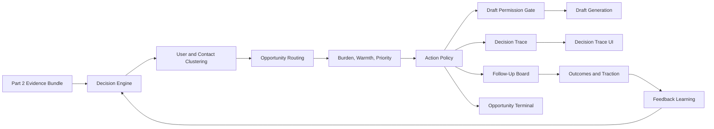
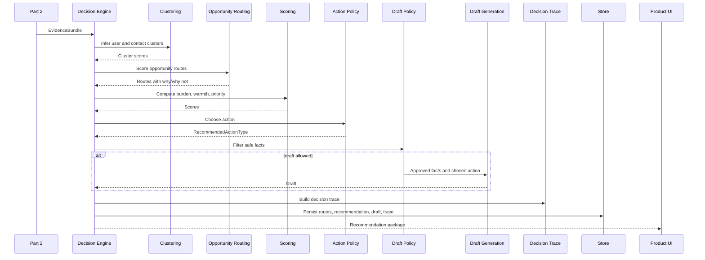

# AfterMeet Intelligence Layer Part 3 - Decision, Action, and Experience SDD

## 1. Introduction

### Purpose

This document defines the independent implementation scope for the Decision, Action, and Experience workstream of the AfterMeet intelligence layer. It consumes the Part 2 evidence bundle, computes goal-conditioned opportunity routes, chooses the next best action, gates safe facts, generates drafts only after action selection, and presents the result through the decision trace, board, terminal, traction, and feedback experiences.

### Intended Audience

- Engineer owning clustering, opportunity routing, scoring, action policy, draft permission, draft generation, decision trace, board, terminal, traction, and feedback learning.
- Engineer integrating with Part 2 evidence bundles.
- Reviewer validating user control, explainability, no-auto-send behavior, and recommendation quality.

### Scope

Included:

- User and contact clustering.
- Multi-route opportunity scoring.
- Recipient burden and warmth decay.
- Opportunity priority score.
- Action policy engine.
- Draft permission gate and draft generation.
- Decision trace object and UI presentation.
- Opportunity terminal, cluster recommendation, follow-up board, traction view, and feedback learning.
- Persistence for routes, recommendations, drafts, and outcomes.
- Demo fixtures for decision trace, recommendations, board, and drafts.
- Unit tests for deterministic scoring and policy functions.

Excluded:

- User objective setup, capture, transcription, and extraction. See Part 1.
- Public enrichment, source records, entity resolution, and fact confidence computation. See Part 2.
- Automatic outreach. The user always sends, edits, snoozes, archives, or marks outcomes manually.

### Definitions

| Term | Meaning |
| --- | --- |
| Evidence bundle | Part 2 output containing contact candidate, public context, source records, evidence facts, entity resolution, and warnings. |
| User cluster | Multi-label interpretation of the user's active objective and recent outcomes. |
| Contact cluster | Multi-label interpretation of a contact's likely relationship to the user's objective. |
| Opportunity route | A possible relationship path, such as user, investor, mentor, partner, candidate, or customer. |
| Recipient burden | Score estimating how costly, generic, or pushy an action would feel to the recipient. |
| Warmth decay | Time-sensitive score estimating whether a thread is going cold. |
| Action policy | Deterministic function that chooses the recommended next action or no action. |
| Decision trace | Human-readable explanation of facts, context, route scores, chosen action, why/why not, confidence, and warnings. |

### References

- Source spec: `docs/intelligence-layer-specs.md`
- Parallel ownership map: `docs/intelligence-layer-parallel-work-ownership.md`
- Shared contracts: `lib/types/index.ts`
- Covered source sections: Product Philosophy, Core Demo Narrative, Database Schema 6.9-6.12, Hard Rules, Pipeline steps 9-18, Phases 9-22, Phase 24.4-24.9, Phase 25, Phase 26 policy tests, Phase 27 build order, Phase 28 MVP cut lines, Phase 29 final MVP acceptance criteria.

### Parallel Work Ownership

Part 3 owns deterministic decisioning, draft permission, draft generation, decision trace, board, terminal, traction, and feedback learning. It consumes `EvidenceBundle` and produces `RecommendationPackage` from `lib/types/handoffs.ts`; it should not edit capture, extraction, Cala, Gemini, entity resolution, or fact confidence implementation files.

Owned implementation paths:

```text
app/api/intelligence/recommend/route.ts
app/api/draft/generate/route.ts
app/api/outcomes/route.ts
app/board/*
app/terminal/*
app/contacts/*
components/DecisionTrace.tsx
components/FiveForksView.tsx
components/FollowUpBoard.tsx
components/OpportunityMatrix.tsx
components/RecommendedGroupCard.tsx
components/ActionQueue.tsx
components/DraftPreview.tsx
components/TractionView.tsx
lib/intelligence/userObjective.ts
lib/intelligence/clustering.ts
lib/intelligence/opportunityRouting.ts
lib/intelligence/scoring.ts
lib/intelligence/warmthDecay.ts
lib/intelligence/recipientBurden.ts
lib/intelligence/actionPolicy.ts
lib/intelligence/draftPolicy.ts
lib/intelligence/draftGeneration.ts
lib/intelligence/decisionTrace.ts
lib/intelligence/groupRecommendation.ts
lib/intelligence/feedbackLearning.ts
```

Shared-with-care paths:

```text
lib/types/*
lib/providers/claude.ts
```

Contract rules:

- Import shared types from `lib/types/index.ts`.
- Keep changes to `RecommendationPackage` additive unless the product UI or process route owner agrees.
- Do not call Part 2 provider files directly; consume `EvidenceBundle`.
- Draft-specific Claude prompts belong in `lib/intelligence/draftGeneration.ts`, not in the low-level provider wrapper.
- Database work in this stream should be limited to `opportunity_routes`, `action_recommendations`, `drafts`, and `outcomes`.

## 2. System Overview

### Context

After capture and evidence construction, the product must decide what the user should do next. The same conversation means different things for different goals, so this workstream combines the user's objective, extracted atoms, evidence confidence, relationship status, timing, and recipient burden to choose an action and explain it.

### Users

- Primary user: event attendee deciding who to follow up with, ignore, confirm, nudge, or reply to.
- Internal consumers: UI screens that need recommendation, board, terminal, and traction data.

### High-Level Architecture



### Key Components

| Component | Responsibility |
| --- | --- |
| `lib/intelligence/userObjective.ts` | Infer user cluster scores from objective and outcomes. |
| `lib/intelligence/clustering.ts` | Classify contact cluster scores from contact, atoms, and public context. |
| `lib/intelligence/opportunityRouting.ts` | Generate multi-label opportunity routes with why and why-not explanations. |
| `lib/intelligence/recipientBurden.ts` | Compute recipient burden and block pushy outreach. |
| `lib/intelligence/warmthDecay.ts` | Compute urgency and coldness by route and status. |
| `lib/intelligence/scoring.ts` | Compute final opportunity priority. |
| `lib/intelligence/actionPolicy.ts` | Choose the recommended action. |
| `lib/intelligence/draftPolicy.ts` | Filter facts allowed in drafts. |
| `lib/intelligence/draftGeneration.ts` | Generate short editable drafts after action selection. |
| `lib/intelligence/decisionTrace.ts` | Assemble human-readable decision trace. |
| `lib/intelligence/groupRecommendation.ts` | Recommend groups/clusters to prioritize next. |
| `lib/intelligence/feedbackLearning.ts` | Apply small outcome-based score adjustments. |
| `DecisionTrace.tsx`, `FollowUpBoard.tsx`, `OpportunityMatrix.tsx`, `TractionView.tsx` | User-facing decision and workflow surfaces. |

### External Integrations

| System | Used For | Boundary |
| --- | --- | --- |
| Claude API | Draft generation if live mode is enabled | Server-only, after action selection and fact gate. |
| Mollie payment link | WTP signal in traction view | Optional, only if provided by env. |
| Supabase/Postgres or fixture store | Persist routes, recommendations, drafts, outcomes | Repository layer hides storage choice. |

## 3. Design Considerations

### Assumptions

- Part 1 has already created objective, conversation, and atoms.
- Part 2 has already computed entity and fact confidence.
- The user remains in control of sending, editing, deleting, snoozing, and overriding.
- A recommendation may be "do not contact", "wait", "stay calm", or "confirm details."
- The draft is the final output, not the product's core decision.

### Constraints

- Do not generate a draft until action selection is complete.
- Do not use low-confidence facts in drafts.
- Do not send messages automatically.
- Do not recommend follow-up for every contact.
- Do not make the product founder-only; all scoring must be goal-conditioned.
- Do not use leaderboard-style grading of humans.
- The UI must show why this action and why not other actions.
- Feedback learning must not overfit to one outcome.

### Dependencies

| Dependency | Purpose | Notes |
| --- | --- | --- |
| Evidence bundle from Part 2 | Fact and confidence input | Stable contract required. |
| Objective profile from Part 1 | Goal-conditioned scoring | Included in upstream handoff or loaded by repository. |
| `ANTHROPIC_API_KEY` | Draft generation | Optional in demo mode. |
| `MOLLIE_PAYMENT_LINK` | WTP signal | Optional. |
| TypeScript | Deterministic scoring contracts | All formulas should be unit tested. |

### Risks and Mitigations

| Risk | Impact | Mitigation |
| --- | --- | --- |
| Generic drafts become spammy | Product violates positioning | Recipient burden, action policy, draft gate, user manual send. |
| Wrong action due to low evidence | Bad recommendations | Entity and fact confidence penalties; confirm details action. |
| Founder-only recommendations | Poor personalization | User cluster model and route weights driven by objective. |
| Complex UI hides the magic moment | Weak demo | Decision trace is concise and inspectable in under 10 seconds. |
| Feedback overfits | Future rankings become noisy | Apply small capped outcome boost only after enough events. |
| Board flags too many contacts | Anxiety and spam | Warning requires stakes times staleness; calm by default. |

## 4. Architectural Strategies

### Selected Strategy

Use a deterministic-first decision engine with a narrow LLM surface for final draft wording only. The engine consumes facts and scores, computes routes and policy decisions in code, creates an explainable trace, then optionally asks Claude to write a short editable draft using only approved facts.

### Rationale

- Preserves evidence-before-output.
- Keeps recommendation behavior testable.
- Makes confidence and burden visible.
- Supports many user roles without hardcoding founder mode.
- Prevents drafts from smuggling in unsafe or low-confidence facts.

### Alternatives Considered

| Alternative | Why Not Selected |
| --- | --- |
| Ask an LLM to choose action and draft together | Hard to test, weak confidence control, violates draft-last philosophy. |
| Single contact label instead of multi-route scores | Loses nuance; one contact can be user and mentor. |
| Auto-send recommended follow-ups | Violates user control and product safety. |
| Board sorted only by capture time | Ignores objective, warmth, commitment, and burden. |

### Key Decisions

- Clustering and scoring are multi-label.
- Action policy can recommend no action.
- Recipient burden can block otherwise high-priority contacts.
- Draft permission gate is required before generation.
- Every recommendation stores a decision trace.
- Board and terminal are downstream views of the same recommendation state.

## 5. System Architecture

### Data Flow



### Primary Service Contract

```ts
async function recommendNextAction(input: {
  evidenceBundle: EvidenceBundle;
  objective: UserObjectiveProfile;
  contactStatus: ContactStatus;
  outcomes: OutcomeSummary[];
  now: string;
}): Promise<RecommendationPackage>;
```

Output:

```ts
interface RecommendationPackage {
  recommendation: ActionRecommendation;
  routes: OpportunityRoute[];
  decisionTrace: DecisionTrace;
  draft?: Draft;
  boardCard: FollowUpBoardCard;
  warnings: string[];
}
```

### API Contracts

#### POST `/api/intelligence/recommend`

Request:

```ts
interface RecommendRequest {
  userId: string;
  conversationId: string;
  contactId?: string;
  evidenceBundle?: EvidenceBundle;
}
```

Success 200:

```ts
interface RecommendResponse {
  recommendation: ActionRecommendation;
  routes: OpportunityRoute[];
  decisionTrace: DecisionTrace;
  draft?: Draft;
  warnings: string[];
}
```

Errors:

| Status | Code | Meaning |
| --- | --- | --- |
| 400 | `VALIDATION_ERROR` | Missing conversation or evidence input. |
| 404 | `CONVERSATION_NOT_FOUND` | User cannot access the conversation. |
| 422 | `EVIDENCE_REQUIRED` | Part 2 evidence is unavailable and cannot be reconstructed. |
| 500 | `RECOMMENDATION_FAILED` | Unexpected deterministic scoring failure. |

#### POST `/api/draft/generate`

Request:

```ts
interface DraftGenerateRequest {
  userId: string;
  recommendationId: string;
  tone?: "direct" | "warm" | "formal" | "casual" | "concise";
}
```

Success 200:

```ts
interface DraftGenerateResponse {
  draft: Draft;
  factsUsed: string[];
  riskNote?: string | null;
}
```

Errors:

| Status | Code | Meaning |
| --- | --- | --- |
| 403 | `DRAFT_NOT_ALLOWED` | Action or fact gate does not permit draft. |
| 404 | `RECOMMENDATION_NOT_FOUND` | Recommendation does not exist for user. |
| 422 | `NO_SAFE_FACTS` | No facts are allowed in a draft. |
| 502 | `DRAFT_PROVIDER_UNAVAILABLE` | Provider failed; demo fixture may be used if enabled. |

#### POST `/api/outcomes`

Request:

```ts
interface OutcomeCreateRequest {
  userId: string;
  contactId: string;
  recommendationId?: string;
  outcomeType:
    | "sent"
    | "reply"
    | "booked"
    | "paid"
    | "wtp"
    | "ignored"
    | "snoozed"
    | "marked_not_relevant"
    | "manual_override";
  notes?: string;
  value?: number;
}
```

Success 201:

```ts
interface OutcomeCreateResponse {
  outcome: Outcome;
  updatedRecommendation?: ActionRecommendation;
  updatedTraction: TractionSummary;
}
```

Errors:

| Status | Code | Meaning |
| --- | --- | --- |
| 400 | `VALIDATION_ERROR` | Invalid outcome type or missing contact. |
| 404 | `CONTACT_NOT_FOUND` | User cannot access contact. |
| 409 | `OUTCOME_CONFLICT` | Duplicate mutually exclusive outcome. |

### Data Models

#### `UserClusterScores`

```ts
interface UserClusterScores {
  fundraising: number;
  hiring: number;
  userDiscovery: number;
  partnerships: number;
  mentorship: number;
  recruiting: number;
  jobSeeking: number;
  sponsorBd: number;
}
```

#### `ContactClusterScores`

```ts
interface ContactClusterScores {
  investor: number;
  potentialUser: number;
  potentialHire: number;
  mentor: number;
  partner: number;
  recruiter: number;
  sponsor: number;
  founderPeer: number;
  lowPriority: number;
}
```

#### `OpportunityRoute`

```ts
interface OpportunityRoute {
  id: string;                         // UUID, PK if persisted
  contactId: string;                  // UUID, FK contacts.id, indexed
  conversationId: string;             // UUID, FK conversations.id
  type: OpportunityType;
  score: number;                      // numeric 0..1
  evidence: string[];                 // JSONB default []
  why: string[];                      // JSONB default []
  whyNot: string[];                   // JSONB default []
  createdAt: string;                  // timestamp
}
```

Indexes:

- `opportunity_routes_contact_idx` on `contact_id`.
- `opportunity_routes_score_idx` on `(contact_id, score DESC)`.

#### `ActionRecommendation`

```ts
interface ActionRecommendation {
  id: string;                         // UUID, PK
  userId: string;                     // UUID, FK users.id, indexed
  contactId: string;                  // UUID, FK contacts.id, indexed
  conversationId: string;             // UUID, FK conversations.id
  recommendedAction: RecommendedActionType;
  priorityScore: number;              // numeric 0..1
  urgencyScore: number;               // numeric 0..1
  recipientBurden: number;            // numeric 0..1
  confidence: number;                 // numeric 0..1
  status: "pending" | "accepted" | "sent" | "snoozed" | "archived" | "overridden";
  explanation: DecisionTrace;         // JSONB
  createdAt: string;                  // timestamp, indexed
}
```

Indexes:

- `action_recommendations_user_status_idx` on `(user_id, status)`.
- `action_recommendations_contact_idx` on `contact_id`.
- `action_recommendations_priority_idx` on `(user_id, priority_score DESC)`.

#### `Draft`

```ts
interface Draft {
  id: string;                         // UUID, PK
  recommendationId: string;           // UUID, FK action_recommendations.id
  contactId: string;                  // UUID, FK contacts.id
  channel: "email" | "linkedin" | "sms" | "manual";
  tone?: string | null;
  subject?: string | null;
  body: string;                       // text, not null
  factsUsed: string[];                // JSONB default []
  status: "drafted" | "edited" | "sent" | "discarded";
  riskNote?: string | null;
  createdAt: string;                  // timestamp
  sentAt?: string | null;             // nullable
}
```

Indexes:

- `drafts_recommendation_idx` on `recommendation_id`.
- `drafts_contact_idx` on `contact_id`.

#### `DecisionTrace`

```ts
interface DecisionTrace {
  inputSummary: string;
  extractedFacts: string[];
  retrievedContext: string[];
  routeScores: OpportunityRoute[];
  chosenRoute: OpportunityRoute;
  chosenAction: RecommendedActionType;
  whyThisAction: string[];
  whyNotOtherActions: string[];
  confidenceBreakdown: {
    entityMatch: number;
    sourceConfidence: number;
    factConfidence: number;
    userGoalFit: number;
    contactPovFit: number;
    recipientBurden: number;
    finalConfidence: number;
  };
  safeFactsUsed: string[];
  warnings: string[];
}
```

#### `Outcome`

```ts
interface Outcome {
  id: string;                         // UUID, PK
  userId: string;                     // UUID, FK users.id, indexed
  contactId: string;                  // UUID, FK contacts.id, indexed
  recommendationId?: string | null;   // UUID, FK action_recommendations.id
  outcomeType:
    | "sent"
    | "reply"
    | "booked"
    | "paid"
    | "wtp"
    | "ignored"
    | "snoozed"
    | "marked_not_relevant"
    | "manual_override";
  notes?: string | null;
  value?: number | null;
  createdAt: string;                  // timestamp, indexed
}
```

Indexes:

- `outcomes_user_created_idx` on `(user_id, created_at DESC)`.
- `outcomes_contact_idx` on `contact_id`.
- `outcomes_type_idx` on `outcome_type`.

### Core Formulas and Policies

Opportunity priority:

```ts
priority =
  0.25 * userGoalFit +
  0.20 * contactPovFit +
  0.15 * stakes +
  0.15 * urgencyDecay +
  0.10 * explicitCommitment +
  0.10 * factConfidence +
  0.05 * relationshipStrength -
  0.15 * recipientBurden -
  0.10 * uncertaintyPenalty;
```

Recipient burden:

```ts
burden =
  0.30 * genericness +
  0.25 * askSize +
  0.20 * weakContextPenalty +
  0.15 * lowMutualValuePenalty +
  0.10 * timingPenalty;
```

Action policy:

```ts
if (entityMatchConfidence < 0.45) return "CONFIRM_DETAILS";
if (recipientBurden > 0.70) return "DO_NOT_CONTACT";
if (status === "new" && priorityScore > 0.65) return actionForOpportunity(topOpportunityRoute);
if (status === "drafted" && priorityScore > 0.55) return "SEND_DRAFT";
if (status === "sent" && urgencyScore > 0.70) return "SEND_NUDGE";
if (status === "reply") return "REPLY_NOW";
if (priorityScore < 0.35) return "STAY_CALM";
return "WAIT";
```

Draft facts:

```ts
safeFacts = facts.filter(fact =>
  fact.factConfidence >= 0.75 &&
  fact.isProfessional === true &&
  fact.isSensitive !== true &&
  fact.sourceType !== "unknown"
);
```

## 6. Policies and Tactics

### Authentication and Authorization

- Recommendation, draft, and outcome routes verify user ownership of contact and conversation.
- MVP may use a seeded demo user, but all queries must include `userId`.
- Production requires RLS before real users.

### Data Protection and Privacy

- Draft generation uses approved facts only.
- Draft body is editable and never sent automatically.
- User can archive, snooze, delete, or manually override recommendations.
- Warnings must be visible when facts are low confidence, context unavailable, or details require confirmation.
- No public people marketplace or discovery UI is created.

### Error Handling and Retry

- Deterministic scoring failures return `RECOMMENDATION_FAILED` and are test-priority bugs.
- Draft provider failures do not erase the recommendation or trace.
- If no safe facts exist, the UI can still show the recommendation and trace without a draft.
- If entity match is low, action policy returns `CONFIRM_DETAILS`.
- If recipient burden is high, action policy returns `DO_NOT_CONTACT` or equivalent no-send state.

### Logging, Metrics, Tracing, Alerting

Log with request IDs:

- Cluster score inputs and outputs.
- Top route and suppressed routes.
- Recipient burden, warmth, priority, and final confidence.
- Action policy branch chosen.
- Draft gate allowed/blocked.
- Outcome creation and feedback boost.

Metrics:

- Recommendation distribution by action type.
- Percentage of contacts receiving no-send recommendations.
- Draft blocked rate.
- Reply, booked, WTP, and paid rates by opportunity type.
- Board warning rate.

### Performance, Scaling, and Caching

- Scoring functions are pure and synchronous.
- Cache route and recommendation results per evidence bundle version.
- Board queries page by status and updated time.
- Traction summaries can be computed from outcomes for MVP and materialized later.
- Avoid LLM draft call when action is `WAIT`, `STAY_CALM`, `DO_NOT_CONTACT`, or `CONFIRM_DETAILS`.

## 7. Detailed Design

### 7.1 Clustering Design

#### Responsibilities

- Infer multi-label user cluster scores.
- Classify multi-label contact cluster scores.
- Preserve nuance rather than forcing one label.

#### Interface

```ts
function inferUserCluster(input: {
  objective: UserObjectiveProfile;
  recentConversations: ConversationSummary[];
  outcomes: OutcomeSummary[];
}): UserClusterScores;

function classifyContactCluster(input: {
  contact: Contact;
  atoms: ConversationAtoms;
  publicContext?: PublicEntityContext[];
}): ContactClusterScores;
```

#### Dependencies

- Objective profile.
- Conversation atoms.
- Public context from evidence bundle.
- Outcomes for small adjustments.

#### Error Handling

- Missing public context still returns scores using conversation atoms.
- Ambiguous contact returns multiple medium scores rather than one false high score.

#### Verification

- Unit tests for founder, recruiter, student, sponsor BD, and investor objectives.
- Test one contact can be both potential user and mentor.

### 7.2 Opportunity Routing and Priority Design

#### Responsibilities

- Generate route candidates.
- Score each route against user objective and evidence.
- Explain why a route was selected and why others were not.

#### Interface

```ts
function scoreOpportunityRoutes(input: {
  userCluster: UserClusterScores;
  contactCluster: ContactClusterScores;
  atoms: ConversationAtoms;
  facts: EvidenceFact[];
  objective: UserObjectiveProfile;
}): OpportunityRoute[];

function opportunityPriority(input: {
  userGoalFit: number;
  contactPovFit: number;
  stakes: number;
  urgencyDecay: number;
  explicitCommitment: number;
  factConfidence: number;
  relationshipStrength: number;
  recipientBurden: number;
  uncertaintyPenalty: number;
}): number;
```

#### Error Handling

- If all route scores are low, return low-priority route plus `STAY_CALM`.
- Contradictory or low-confidence evidence increases uncertainty penalty.

#### Verification

- Unit test user-discovery objective ranks potential users above investors.
- Unit test explicit commitment raises priority.
- Unit test low fact confidence lowers priority.

### 7.3 Recipient Burden and Warmth Design

#### Responsibilities

- Prevent spammy, vague, or high-friction outreach.
- Estimate urgency based on opportunity type, status, and time.

#### Interface

```ts
function recipientBurden(input: {
  messageSpecificity: number;
  askSize: number;
  relationshipStrength: number;
  mutualValue: number;
  timingFit: number;
}): number;

function warmthScore(input: {
  opportunityType: OpportunityType;
  hoursSinceLastAction: number;
  status: ContactStatus;
}): number;
```

#### Error Handling

- Missing status defaults to `new`.
- Booked status returns no warning.
- High burden blocks pushy draft generation.

#### Verification

- Unit test generic coffee ask yields high burden.
- Unit test booked never flags as going cold.
- Unit test reply status creates urgent action.

### 7.4 Action Policy Design

#### Responsibilities

- Choose the next best action or no action.
- Respect confidence, recipient burden, status, priority, urgency, and explicit commitments.
- Produce inputs for decision trace.

#### Interface

```ts
function chooseAction(input: {
  status: ContactStatus;
  entityMatchConfidence: number;
  recipientBurden: number;
  priorityScore: number;
  urgencyScore: number;
  topOpportunityRoute: OpportunityRoute;
  hasExplicitCommitment: boolean;
}): RecommendedActionType;
```

#### Error Handling

- Low entity match returns `CONFIRM_DETAILS`.
- High burden returns `DO_NOT_CONTACT`.
- Low priority returns `STAY_CALM`.

#### Verification

- Unit tests for each policy branch.
- Regression test that no action is recommended when priority is low.

### 7.5 Draft Permission and Generation Design

#### Responsibilities

- Allow only safe facts into drafts.
- Generate a short editable draft after action selection.
- Return facts used and risk note.

#### Interface

```ts
function factsAllowedInDraft(facts: EvidenceFact[]): EvidenceFact[];

async function generateDraft(input: {
  objective: UserObjectiveProfile;
  contact: Contact;
  action: RecommendedActionType;
  factsAllowedInDraft: EvidenceFact[];
  whyThis: string[];
  recipientBurden: number;
  tone: string;
}): Promise<Draft>;
```

#### Dependencies

- Evidence facts from Part 2.
- Action recommendation.
- Claude provider or demo fixture.

#### Error Handling

- No safe facts returns `NO_SAFE_FACTS`.
- Draft provider failure returns typed provider error and keeps recommendation intact.
- Actions that should not produce drafts return `DRAFT_NOT_ALLOWED`.

#### Verification

- Unit test low-confidence fact excluded.
- Unit test unknown source excluded.
- Integration test draft uses only `factsUsed`.
- Manual test draft is editable and not sent automatically.

### 7.6 Decision Trace Design

#### Responsibilities

- Show how the system moved from conversation to action.
- Explain why this action and why not others.
- Display confidence and warnings.

#### Interface

```ts
function buildDecisionTrace(input: {
  inputSummary: string;
  atoms: ConversationAtoms;
  evidenceBundle: EvidenceBundle;
  routes: OpportunityRoute[];
  chosenAction: RecommendedActionType;
  confidenceBreakdown: DecisionTrace["confidenceBreakdown"];
  safeFactsUsed: string[];
  warnings: string[];
}): DecisionTrace;
```

#### UI Requirements

- Cascade sections: Conversation, Facts, Context, Routes, Decision, Draft.
- Understandable in under 10 seconds.
- Show suppressed routes and why-not explanations.
- Show "public context unavailable" without apology loops or invented facts.

#### Verification

- Component test with demo narrative.
- Snapshot test of trace object.
- Manual demo review.

### 7.7 Board, Terminal, Traction, and Feedback Design

#### Responsibilities

- Follow-Up Board tracks status and warmth.
- Opportunity Terminal shows objective, coverage, gaps, recommended clusters, action queue, and attention budget.
- Traction View shows proof metrics, not vanity capture counts.
- Feedback Learning applies small outcome-based adjustments.

#### Interface

```ts
function recommendNextCluster(input: {
  userObjective: UserObjectiveProfile;
  currentClusters: ContactClusterSummary[];
  outcomes: OutcomeSummary[];
  attentionBudget: number;
}): ClusterRecommendation[];

function feedbackBoost(input: {
  opportunityType: OpportunityType;
  outcomes: OutcomeSummary[];
}): number;
```

#### Board Rules

- New going cold -> first follow-up.
- Drafted going cold -> send existing draft.
- Sent going cold -> gentle nudge.
- Reply waiting -> respond now.
- Booked -> never flags.
- Archived -> calm.

#### Verification

- Unit test feedback boost is capped and small.
- Integration test outcome updates traction summary.
- Component test board columns and warning flags.
- Component test terminal adapts to different user objectives.

## 8. Appendix

### Requirement Traceability

| Requirement | Design Component | Verification |
| --- | --- | --- |
| P3-REQ-001 User and contact clusters are multi-label. | `userObjective.ts`, `clustering.ts` | Unit tests |
| P3-REQ-002 Opportunity routes include why and why-not. | `opportunityRouting.ts` | Unit and snapshot tests |
| P3-REQ-003 Recipient burden blocks spammy actions. | `recipientBurden.ts`, `actionPolicy.ts` | Unit tests |
| P3-REQ-004 Warmth depends on opportunity type and status. | `warmthDecay.ts`, board | Unit and component tests |
| P3-REQ-005 Action policy can recommend no action. | `actionPolicy.ts` | Unit tests |
| P3-REQ-006 Drafts use only approved facts. | `draftPolicy.ts`, `draftGeneration.ts` | Unit and integration tests |
| P3-REQ-007 Messages are never auto-sent. | Draft UI, outcome flow | Manual and component tests |
| P3-REQ-008 Every recommendation has a decision trace. | `decisionTrace.ts`, recommendation persistence | Integration test |
| P3-REQ-009 Board tracks status and rare warning flags. | `FollowUpBoard.tsx`, warmth scoring | Component tests |
| P3-REQ-010 Traction view shows proof metrics. | `TractionView.tsx`, outcomes | Integration test |
| P3-REQ-011 Feedback learning affects future scores slightly. | `feedbackLearning.ts` | Unit tests |
| P3-REQ-012 Demo mode works without live draft provider. | Demo fixtures | Env-based integration test |

### Handoff from Part 2

Part 3 consumes the `EvidenceBundle` defined in Part 2. It must not call Cala, Gemini, or source confidence directly.

### Handoff to Product UI

Part 3 is complete when it can reliably produce this object:

```ts
interface RecommendationPackage {
  recommendation: ActionRecommendation;
  routes: OpportunityRoute[];
  decisionTrace: DecisionTrace;
  draft?: Draft;
  boardCard: FollowUpBoardCard;
  warnings: string[];
}
```

### Build Order Within This Workstream

1. Deterministic scoring types and tests.
2. User and contact clustering.
3. Opportunity routing.
4. Recipient burden and warmth decay.
5. Priority scoring.
6. Action policy.
7. Decision trace fixture and UI.
8. Draft gate and generation.
9. Contact list, person view, and board.
10. Opportunity terminal.
11. Traction view.
12. Feedback learning.
13. Demo fallback and polish.

### MVP Cut Lines for This Workstream

Cut first if behind:

- Opportunity terminal.
- Feedback learning.
- Advanced clustering.
- Live draft provider if fixture draft is enough for demo.

Never cut:

- Multi-route scoring.
- Recipient burden.
- Action policy.
- Decision trace.
- Draft permission gate.
- Manual send control.
- Board.

### Deferred Decisions

- Exact tone taxonomy for route-specific drafts.
- Whether opportunity terminal ships as a separate route or dashboard panel.
- Minimum outcome count before feedback boost is applied.
- Whether WTP uses a Mollie link directly or a manual outcome marker in MVP.

### Quality Checklist

- Every known requirement is addressed or explicitly deferred.
- Data models include types, constraints, nullability, indexes, and relationships.
- API contracts include request and response schemas plus error cases.
- Security and privacy decisions are explicit.
- Error scenarios and retry behavior are documented.
- Performance tactics avoid unnecessary LLM calls.
- Dependencies and boundaries with Parts 1 and 2 are named.
- Diagrams clarify data flow and sequence-sensitive behavior.
- Open questions are grouped clearly.
- Original source spec remains unchanged.
