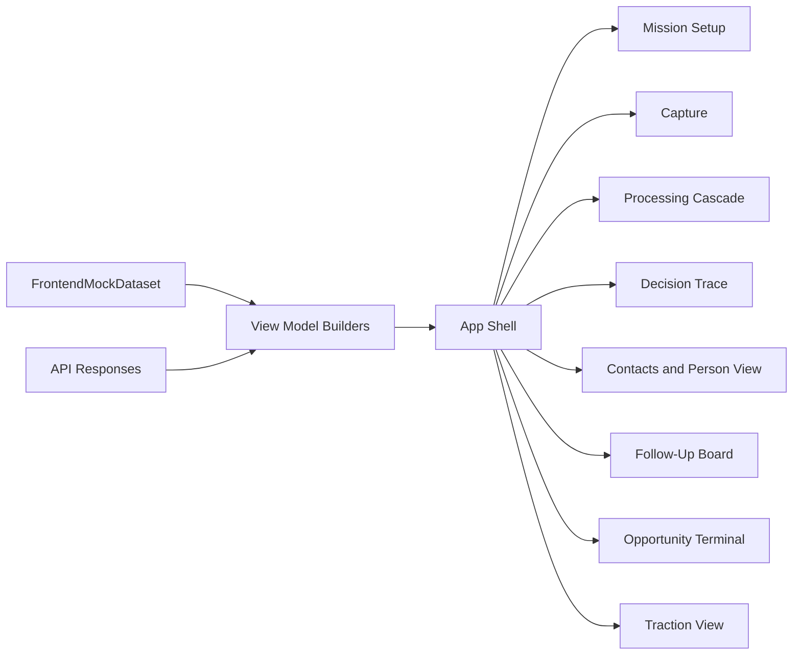
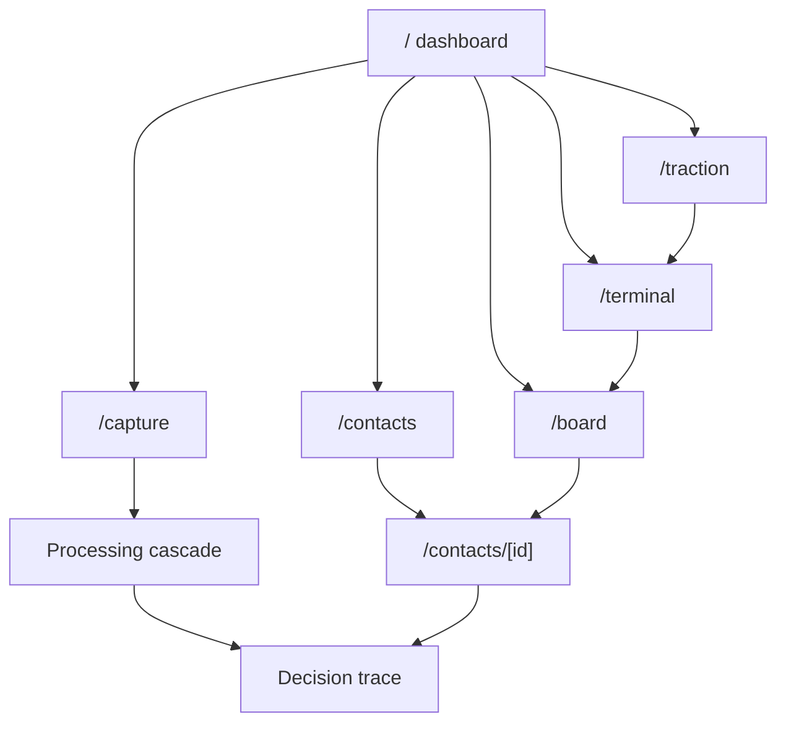
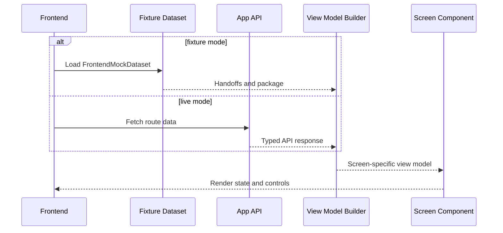

# AfterMeet Intelligence Layer Part 4 - Frontend Experience and Visualization SDD

## 1. Introduction

### Purpose

This document defines the independent frontend implementation scope for AfterMeet. The frontend workstream visualizes the intelligence pipeline, lets users capture conversations, inspect decision traces, manage follow-ups, and understand traction without editing backend intelligence implementation files.

### Intended Audience

- Frontend engineer owning routes, components, interaction states, and visual polish.
- Backend engineers exposing API responses and typed view data.
- Reviewer validating that the app makes the intelligence layer visible, usable, and calm.

### Scope

Included:

- App shell and navigation.
- Mission setup screen.
- Capture screen for text, voice, and card fallback UI.
- Processing cascade visualization.
- Decision trace screen.
- Contact list and person view.
- Follow-up board.
- Opportunity terminal.
- Traction view.
- Draft preview and manual outcome actions.
- Fixture-backed UI development using `FrontendMockDataset`.

Excluded:

- Extraction, transcription, enrichment, scoring, action policy, and draft-generation algorithms.
- Provider wrappers for Gemini, OpenAI, Cala, Gemini, or Mollie.
- Database migrations and repository ownership.
- Automatic outreach or message sending.

### Definitions

| Term | Meaning |
| --- | --- |
| View model | A typed UI data shape from `lib/types/ui.ts` that can be backed by mock data or API data. |
| Fixture mode | Frontend mode that renders screens from saved `FrontendMockDataset` objects. |
| Processing cascade | Visual stage list showing capture, extraction, enrichment, scoring, action choice, and draft generation. |
| Decision trace | The visible explanation from conversation to chosen action. |
| Terminal | Portfolio-level view of objectives, coverage gaps, recommended clusters, and action queue. |

### References

- Source spec: `docs/intelligence-layer-specs.md`
- Parallel ownership map: `docs/intelligence-layer-parallel-work-ownership.md`
- Visual map: `docs/intelligence-layer-visualization-map.md`
- Shared frontend contracts: `lib/types/ui.ts`
- Shared API and handoff contracts: `lib/types/index.ts`

### Parallel Work Ownership

Part 4 owns frontend routes, components, view models, visual states, and fixture-backed demos. It consumes `ExtractionHandoff`, `EvidenceBundle`, `RecommendationPackage`, API responses, and `ProcessStageEvent` from `lib/types`; it must not import backend intelligence implementation files.

Owned implementation paths:

```text
app/page.tsx
app/capture/*
app/contacts/*
app/board/*
app/terminal/*
app/traction/*
components/AppShell.tsx
components/MissionSetup.tsx
components/CaptureCard.tsx
components/VoiceCapture.tsx
components/CardScan.tsx
components/ConversationAtomsView.tsx
components/FiveForksView.tsx
components/DecisionTrace.tsx
components/ConfidenceBreakdown.tsx
components/SourceRegister.tsx
components/ContactList.tsx
components/PersonView.tsx
components/FollowUpBoard.tsx
components/WarmthDecayBar.tsx
components/OpportunityMatrix.tsx
components/RecommendedGroupCard.tsx
components/ActionQueue.tsx
components/DraftPreview.tsx
components/TractionView.tsx
lib/frontend/*
```

Shared-with-care paths:

```text
lib/types/ui.ts
lib/demo/*
```

Contract rules:

- Import shared types from `lib/types/index.ts`.
- Use mock data first, then swap to API responses without changing component contracts.
- Do not import from `lib/intelligence/*` or `lib/providers/*`.
- Do not own database tables or migrations.
- Do not add UI text that implies auto-send or autonomous outreach.

## 2. System Overview

### Context

The frontend is the product surface for the intelligence layer. It shows the user how AfterMeet moved from raw conversation to evidence, routes, action, and draft. It also gives the user calm controls to edit, send manually, snooze, archive, and record outcomes.

### Users

- Event attendee using AfterMeet during or after a networking event.
- Demo presenter showing the intelligence cascade.
- Engineers using fixtures to validate contracts before backend integration is complete.

### High-Level Architecture



### Key Components

| Component | Responsibility |
| --- | --- |
| `AppShell.tsx` | Navigation, layout, active objective display, global loading/error surfaces. |
| `MissionSetup.tsx` | Objective form UI backed by Part 1 contracts. |
| `CaptureCard.tsx` | Text capture first, voice/card affordances, acceptable-use note. |
| `ProcessingCascade` | Stage visualization from `ProcessStageEvent`. |
| `DecisionTrace.tsx` | Conversation-to-action explanation. |
| `FiveForksView.tsx` | Multi-route opportunity visualization. |
| `SourceRegister.tsx` | Source provenance and confidence display. |
| `FollowUpBoard.tsx` | Status columns and warmth/coldness flags. |
| `OpportunityMatrix.tsx` | Objective coverage and opportunity balance. |
| `TractionView.tsx` | Proof metrics from outcomes. |

### External Systems

The frontend talks only to application APIs:

- `/api/capture/text`
- `/api/capture/voice`
- `/api/capture/card`
- `/api/intelligence/process`
- `/api/intelligence/recommend`
- `/api/draft/generate`
- `/api/outcomes`
- `/api/demo/reset`

It never calls provider APIs directly.

## 3. Design Considerations

### Assumptions

- A frontend engineer can build with fixtures before backend routes exist.
- The primary demo path is text capture, then processing cascade, then decision trace.
- The UI should feel like an operational tool, not a marketing landing page.
- The product should be calm by default and reserve urgency for rare high-stakes cases.

### Constraints

- First screen should be the usable app, not a landing page.
- Do not expose API keys in client code.
- Do not imply the app sends messages automatically.
- Do not use leaderboard-style grading of people.
- Text must fit across mobile and desktop.
- Draft preview must show manual controls only.
- If context is unavailable, show that plainly without inventing facts.

### Dependencies

| Dependency | Purpose |
| --- | --- |
| `lib/types/ui.ts` | View model contracts. |
| `lib/types/api.ts` | API request and response contracts. |
| `lib/types/handoffs.ts` | Fixture and integration data. |
| `lib/demo/*` | Saved mock data for frontend-first work. |
| App framework | Next.js App Router or equivalent chosen during foundation. |

### Risks and Mitigations

| Risk | Impact | Mitigation |
| --- | --- | --- |
| Frontend waits on backend | Parallel work stalls | Build from `FrontendMockDataset` first. |
| UI hides why the action was chosen | Misses product magic moment | Decision trace is first-class screen and cascade. |
| Too many warnings | Product feels anxious | Board is calm by default; warning requires stakes and staleness. |
| Components import backend logic | Merge conflicts and tight coupling | Components consume view models only. |
| Demo fails due to API key gaps | Weak presentation | Fixture mode labels demo data and works without live providers. |

## 4. Architectural Strategies

### Selected Strategy

Use contract-first, fixture-backed UI development. Components receive view models from `lib/types/ui.ts`. During early build, view models are created from mock data. During integration, the same view models are created from API responses.

### Rationale

- Frontend can build in parallel with all backend workstreams.
- Visual QA is possible before live providers exist.
- API and intelligence internals can change behind stable contracts.
- The demo path can be reliable even without live keys.

### Alternatives Considered

| Alternative | Why Not Selected |
| --- | --- |
| Frontend imports intelligence functions directly | Creates conflicts and hides API boundaries. |
| Wait for backend before building UI | Blocks parallel work. |
| Build only generic dashboards first | Misses the conversation-to-action visualization. |
| Treat frontend as part of Part 3 | Couples product experience to decision engine implementation. |

### Key Decisions

- Part 4 owns all app routes and visual components.
- Backend workstreams own APIs and service functions.
- Every major screen has a view model contract.
- Fixture mode is a first-class frontend development path.
- The decision trace is the primary visualization, not a secondary detail.

## 5. System Architecture

### Route Map



### Screen-to-Contract Matrix

| Screen | Primary View Model | Source Contract |
| --- | --- | --- |
| Dashboard | `MissionSetupViewModel`, `OpportunityTerminalViewModel` | Objective, `RecommendationPackage`, outcomes |
| Capture | `CaptureScreenViewModel` | Objective, capture API contracts |
| Processing | `ProcessingCascadeViewModel` | `ProcessStageEvent` |
| Decision Trace | `DecisionTraceViewModel` | `RecommendationPackage` |
| Contacts | `ContactListViewModel` | Contact summaries |
| Person View | `PersonViewModel` | `EvidenceBundle`, `RecommendationPackage` |
| Board | `FollowUpBoardViewModel` | `FollowUpBoardCard[]` |
| Terminal | `OpportunityTerminalViewModel` | Routes, cluster recommendations, board cards |
| Traction | `TractionViewModel` | `TractionSummary` |

### Visual Data Flow



### View Model Contracts

All frontend screens should consume types from `lib/types/ui.ts`:

- `ProcessingCascadeViewModel`
- `DecisionTraceViewModel`
- `MissionSetupViewModel`
- `CaptureScreenViewModel`
- `ContactListViewModel`
- `PersonViewModel`
- `FollowUpBoardViewModel`
- `OpportunityTerminalViewModel`
- `TractionViewModel`
- `FrontendMockDataset`

### API Boundary

The frontend may call app API routes, but must not import:

```text
lib/intelligence/*
lib/providers/*
lib/db/*
```

## 6. Policies and Tactics

### Authentication and Authorization

- MVP may render a seeded demo user.
- Future authenticated UI should route all user-specific reads through server APIs.
- Frontend should not assume access to raw service-role credentials or provider keys.

### Data Protection and Privacy

- Show acceptable-use text on capture.
- Do not display sensitive non-professional details if backend warnings mark them unsafe.
- Let the user delete or remove facts once backend endpoints exist.
- Show source provenance for enriched facts.
- Draft preview must be editable and manual-send only.

### Error Handling and Empty States

Every major screen supports:

- `loading`
- `ready`
- `empty`
- `fallback`
- `blocked`
- `error`

Fallback states must label demo data clearly and should never pretend to be live enrichment.

### Logging and QA

Frontend should record or expose:

- Current route.
- Active objective.
- Fixture mode versus live mode.
- Stage status transitions.
- Missing required view model fields during development.

### Performance and Responsiveness

- Keep board and contact lists scannable.
- Use stable dimensions for cards, route meters, status columns, and cascade stages.
- Avoid layout shift when stage labels or warnings appear.
- Build mobile and desktop layouts from the start.

## 7. Detailed Design

### 7.1 App Shell

#### Responsibilities

- Provide route navigation.
- Show active objective and event context.
- Provide consistent loading, error, and demo-mode surfaces.

#### Interface

```ts
interface AppShellProps {
  navigation: NavigationItem[];
  activeObjective?: UserObjectiveProfile;
  demoMode: boolean;
}
```

#### Verification

- Component test for active route and demo badge.
- Mobile and desktop visual check.

### 7.2 Capture and Mission Setup

#### Responsibilities

- Let the user create or update an objective.
- Let the user submit text capture first.
- Show voice and card affordances without blocking text fallback.
- Show acceptable-use note.

#### Contracts

- `MissionSetupViewModel`
- `CaptureScreenViewModel`
- `TextCaptureRequest`
- `CaptureAcceptedResponse`

#### Verification

- Form validation test.
- Text capture happy-path interaction test using mocked API.
- Manual check that acceptable-use text is visible.

### 7.3 Processing Cascade

#### Responsibilities

- Visualize stage updates from capture through draft generation.
- Show fallback and unavailable states without breaking the flow.

#### Contracts

- `ProcessStageEvent`
- `ProcessingCascadeViewModel`

#### Verification

- Component test for stage order.
- Test fallback and error statuses.
- Manual test streaming updates with fixture events.

### 7.4 Decision Trace

#### Responsibilities

- Show extracted facts, public context, route scores, chosen action, why this, why not others, confidence, warnings, and draft preview.

#### Contracts

- `DecisionTraceViewModel`
- `RecommendationPackage`

#### Verification

- Fixture rendering test for the Maya demo narrative.
- Snapshot test for route score visualization.
- Manual check that trace is understandable in under 10 seconds.

### 7.5 Contacts and Person View

#### Responsibilities

- Show calm contact list with rare follow-up flags.
- Show one person's transcript, atoms, context, source register, recommendation, draft, and history.

#### Contracts

- `ContactListViewModel`
- `PersonViewModel`
- `EvidenceBundle`
- `RecommendationPackage`

#### Verification

- Component test contact list empty and populated states.
- Manual check that no human leaderboard language appears.

### 7.6 Follow-Up Board

#### Responsibilities

- Show status columns: New, Drafted, Sent, Reply, Booked.
- Surface warmth/coldness only when stakes and staleness justify it.
- Provide manual outcome actions.

#### Contracts

- `FollowUpBoardViewModel`
- `FollowUpBoardCard`
- `OutcomeCreateRequest`
- `OutcomeCreateResponse`

#### Verification

- Component test column grouping.
- Interaction test mark sent, reply, booked.
- Manual check booked cards do not flag as cold.

### 7.7 Opportunity Terminal and Traction

#### Responsibilities

- Show active objective, opportunity mix, coverage gaps, recommended next cluster, action queue, attention budget, and proof metrics.
- Avoid vanity metrics as primary signals.

#### Contracts

- `OpportunityTerminalViewModel`
- `TractionViewModel`
- `ClusterRecommendation`
- `TractionSummary`

#### Verification

- Component test terminal adapts to two different objectives.
- Component test traction prioritizes replies, booked, WTP, and paid signals.

## 8. Appendix

### Requirement Traceability

| Requirement | Design Component | Verification |
| --- | --- | --- |
| P4-REQ-001 Frontend can build from fixtures before backend exists. | `FrontendMockDataset`, view model builders | Component tests with fixtures |
| P4-REQ-002 Processing cascade visualizes pipeline stages. | Processing cascade component | Stage order and fallback tests |
| P4-REQ-003 Decision trace is visible and understandable. | Decision trace screen | Fixture snapshot and manual demo |
| P4-REQ-004 Frontend does not import intelligence implementation files. | Import boundary rule | Static import check |
| P4-REQ-005 Drafts are manual-send only. | Draft preview and outcome controls | Interaction test |
| P4-REQ-006 Board is calm by default. | Follow-up board | Component tests for warning flags |
| P4-REQ-007 Terminal adapts to user objective. | Opportunity terminal | Fixture tests for multiple objectives |
| P4-REQ-008 Traction shows proof metrics. | Traction view | Component test |

### Frontend Fixture Plan

Create one fixture bundle that includes:

```ts
FrontendMockDataset
```

It should contain:

- A seeded objective.
- A fixture `ExtractionHandoff`.
- A fixture `EvidenceBundle`.
- A fixture `RecommendationPackage`.
- A sequence of `ProcessStageEvent` values.
- At least one board card per status.
- A traction summary with sent, reply, booked, WTP, and paid examples.

### Deferred Decisions

- Exact framework if the app scaffold is not created yet.
- Whether terminal appears as dashboard content or a separate route first.
- Visual style tokens and component library choices.
- Whether the first demo uses live streamed events or fixture replay.

### Quality Checklist

- Every screen has a typed view model.
- Frontend can run from fixtures.
- Frontend does not import backend implementation files.
- Loading, empty, fallback, blocked, and error states are defined.
- Decision trace and processing cascade are first-class visuals.
- Manual-send control is explicit.
- Mobile and desktop layouts are planned.
