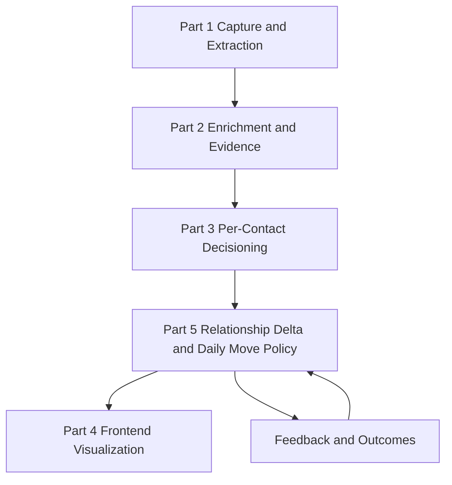
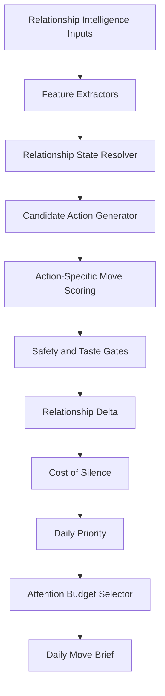

# AfterMeet Intelligence Layer Part 5 - Relationship Delta and Daily Move Policy SDD

## 1. Introduction

### Purpose

This document defines the moat layer of AfterMeet: the Relationship Delta and Daily Move Policy system.

Parts 1-4 already establish how AfterMeet captures conversations, extracts structured atoms, enriches professional evidence, chooses a per-contact action, generates safe drafts, and visualizes the decision path. Part 5 sits above those layers and answers the product's most important recurring question:

```text
What relationship move should the user make today, and what changes if they do nothing?
```

This layer turns AfterMeet from a follow-up assistant into a daily relationship operating system.

The core principle:

```text
Rank moves, not people.
```

AfterMeet should not say "Elena is an 87." It should say:

```text
Best move today:
Follow up with Elena about the distributed systems conversation.

Why now:
- The relationship is still warm.
- The mission gap is senior infra talent.
- The ask is low burden.
- Waiting materially reduces the chance of a useful second conversation.

What to avoid:
- Do not pitch a formal role yet.
- Do not use public-only facts that were not part of the conversation.
```

### Intended Audience

- Engineer implementing the relationship-delta scoring module.
- Engineer integrating Part 3 recommendations into a daily move selector.
- Engineer owning type contracts between scoring, frontend, and feedback.
- Product reviewer validating taste, privacy, explainability, and retention loop.
- Frontend engineer consuming daily brief, radar, board, and detail-screen outputs.

### Scope

Included:

- Relationship Delta formula.
- Cost of Silence formula.
- Daily Priority formula.
- Source-of-values strategy for every numeric factor.
- Candidate action scoring.
- Hard safety gates.
- Tastefulness gate.
- Creepiness and pushiness checks.
- Daily attention budget selector.
- Relationship state model.
- Feedback learning boundaries.
- Type contracts.
- Test fixture matrix.

Excluded:

- Raw conversation capture. See Part 1.
- Public evidence retrieval and fact confidence. See Part 2.
- Per-contact opportunity routing and draft generation. See Part 3.
- UI rendering and storyboard behavior. See Part 4.
- Autonomous sending, mass outreach, scraping, or public discovery. These remain out of scope.

### Relationship To Existing Docs

This document does not duplicate Part 3. Part 3 owns:

- opportunity route scoring
- recipient burden
- action policy
- draft permission
- decision trace

Part 5 owns:

- cross-contact daily ranking
- Relationship Delta
- Cost of Silence
- action-specific move scoring
- attention budget
- "why today vs later"
- "what to avoid"
- feedback tuning of move quality

Part 3 can produce a good next action for one relationship. Part 5 decides whether that action deserves one of the user's scarce daily slots.

### Core Product Thesis

Users do not return daily because an app stores contacts.

They return daily because the app answers:

- Who am I forgetting?
- Which relationship is cooling?
- What action has the highest upside today?
- Which action would be too pushy?
- What can safely wait?
- What should I not say?

Part 5 is the engine behind that daily loop.

---

## 2. Definitions

| Term | Meaning |
| --- | --- |
| Relationship Delta | Estimated upside of acting on a relationship now, after accounting for readiness, timing, evidence, cost, and risk. |
| Cost of Silence | Estimated downside of doing nothing today. |
| Daily Priority | Final ranking score used to choose the user's limited set of recommended moves. |
| Move | A specific action on a specific relationship, such as share a resource, wait, confirm details, ask for intro, or re-engage. |
| Candidate Action | One possible action generated for a relationship before scoring. |
| Attention Budget | Maximum number of meaningful moves the user should see in a daily brief. |
| Tastefulness Gate | A safety gate that blocks actions that may be correct strategically but socially clumsy. |
| Creepiness Risk | Risk that using an enriched fact feels invasive, over-researched, or unrelated to the user's actual conversation. |
| Pushiness Risk | Risk that the action asks too much relative to warmth, permission, timing, and previous nudges. |
| Relationship State | Operational status of the relationship, such as new, warm, waiting, cooling, dormant, blocked, or converted. |
| Feature Extractor | Deterministic code that converts raw structured inputs into normalized scores from 0.0 to 1.0. |
| Normalizer | Deterministic mapper from labels, timestamps, counts, or enums into a numeric score. |

---

## 3. Product Rules

### Hard Rules

- Do not rank people as human value.
- Rank possible moves against the user's mission.
- Do not generate a draft before choosing an action.
- Do not recommend outreach when evidence is too weak.
- Do not recommend high-burden asks on low-warmth relationships.
- Do not use public-only facts in drafts unless they are professional, source-backed, safe, and contextually relevant.
- Do not expose full scoring internals in the frontend.
- Do not optimize only for replies.
- Do not encourage spam.
- Do not contact anyone automatically.

### Positive Rules

- Prefer fewer, higher-quality moves.
- Prefer useful actions over extractive asks.
- Prefer confirm-details when uncertain.
- Prefer wait when the right move is not clear.
- Prefer "share value first" before high-friction asks.
- Explain why a move matters today.
- Explain what not to do.
- Preserve user control.

---

## 4. High-Level Architecture

### Layer Position



### Internal Flow



### Main Modules

```text
lib/intelligence/layer5/constants.ts
lib/intelligence/layer5/normalizers.ts
lib/intelligence/layer5/features.ts
lib/intelligence/layer5/relationshipState.ts
lib/intelligence/layer5/relationshipWarmth.ts
lib/intelligence/layer5/missionImpact.ts
lib/intelligence/layer5/actionReadiness.ts
lib/intelligence/layer5/timingWindow.ts
lib/intelligence/layer5/risk.ts
lib/intelligence/layer5/relationshipDelta.ts
lib/intelligence/layer5/costOfSilence.ts
lib/intelligence/layer5/candidateActions.ts
lib/intelligence/layer5/actionScoring.ts
lib/intelligence/layer5/dailyMoveSelector.ts
lib/intelligence/layer5/explanations.ts
lib/intelligence/layer5/feedback.ts
```

The module names are intentionally small. Each file should own one concept and be unit-testable without LLM calls.

---

## 5. Source-Of-Values Strategy

### Core Rule

No score may exist without a traceable source.

Every numeric value must come from one of:

```text
1. Conversation atoms
2. Evidence facts
3. User objective profile
4. Relationship/action history
5. System default tables
6. User feedback/outcomes
```

LLMs may extract labels from messy text. Deterministic code maps those labels to scores.

```text
LLM extracts labels.
Code assigns scores.
Code makes decisions.
```

### Score Evidence Shape

Every important score should be explainable internally through a feature record:

```ts
export interface ScoreFeature {
  key: string;
  source:
    | "conversation"
    | "evidence"
    | "objective"
    | "history"
    | "default"
    | "feedback";
  rawValue: string | number | boolean | null;
  normalizedValue: number;
  confidence: number;
  reason: string;
}
```

Example:

```ts
{
  key: "explicitFollowupPermission",
  source: "conversation",
  rawValue: "She asked me to send notes",
  normalizedValue: 1.0,
  confidence: 0.92,
  reason: "Conversation contains explicit permission to follow up"
}
```

The UI may show a simplified explanation, but the full feature record remains internal.

### Normalization Rules

All feature scores use:

```text
0.00 = absent, harmful, or no evidence
0.25 = weak
0.50 = medium
0.75 = strong
1.00 = explicit, direct, or high confidence
```

Scores must be clamped:

```ts
function clamp01(value: number): number {
  return Math.max(0, Math.min(1, value));
}
```

Missing data does not default to optimistic values. Missing data should usually become:

```text
0.00 for positive signals
0.50 for neutral unknowns
positive penalty for safety risks
```

---

## 6. Relationship Delta Formula

### Baseline Formula

```ts
relationshipDelta =
  opportunityUpside
  * actionReadiness
  * timingWindow
  * evidenceConfidence
  - actionCost
  - riskPenalty;
```

Clamp:

```ts
relationshipDelta = clamp01(relationshipDelta);
```

### Expanded Formula

```ts
opportunityUpside =
  0.45 * missionImpact +
  0.30 * relationshipFit +
  0.25 * strategicScarcity;

actionReadiness =
  0.35 * relationshipWarmth +
  0.30 * nextStepClarity +
  0.25 * reciprocityFit +
  0.10 * permissionStrength;

timingWindow =
  0.40 * freshnessBoost +
  0.35 * decayRisk +
  0.25 * externalUrgency;

actionCost =
  0.45 * recipientBurden +
  0.30 * userEffort +
  0.25 * askSize;

riskPenalty =
  0.40 * pushinessRisk +
  0.30 * uncertaintyPenalty +
  0.30 * creepinessRisk;
```

### Why Multiplication Exists

The positive components multiply because a move should only become strong when several conditions align.

Example:

```text
High mission impact but low evidence confidence should not produce a high action score.
High warmth but no mission relevance should not dominate the daily brief.
Strong timing but high pushiness should be blocked.
```

The negative components subtract because costs and risks should suppress otherwise attractive moves.

---

## 7. Factor Definitions And Value Sources

### 7.1 Mission Impact

Question:

```text
How much can this relationship help the user's current objective?
```

Formula:

```ts
missionImpact =
  0.40 * roleMatch +
  0.25 * companyFit +
  0.20 * explicitConversationFit +
  0.15 * missionGapFit;
```

Sources:

| Subfactor | Source | How value is produced |
| --- | --- | --- |
| `roleMatch` | contact candidate, enrichment, objective | Compare role/title/category to target roles in user objective. |
| `companyFit` | contact company, evidence facts, objective | Compare company sector/stage/size/geography to objective target segment. |
| `explicitConversationFit` | conversation atoms | Detect direct mention of the user's mission topic. |
| `missionGapFit` | objective state, pipeline state | Score high when the relationship fills a currently under-covered mission gap. |

Baseline mappings:

```ts
const ROLE_MATCH = {
  exact_target_role: 1.0,
  adjacent_target_role: 0.7,
  influencer_or_gatekeeper: 0.6,
  broad_industry_match: 0.4,
  unrelated_role: 0.1,
  unknown: 0.3
};
```

Example:

```text
Mission: Recruit senior infra talent.
Contact: Lead AI Systems Architect.
roleMatch = 0.95
```

### 7.2 Relationship Fit

Question:

```text
Is this the right relationship type for the mission?
```

Formula:

```ts
relationshipFit =
  0.35 * statedInterest +
  0.25 * goalRouteMatch +
  0.20 * conversationDepth +
  0.20 * mutualRelevance;
```

Sources:

| Subfactor | Source | How value is produced |
| --- | --- | --- |
| `statedInterest` | conversation atoms | Did contact express interest, curiosity, need, or willingness? |
| `goalRouteMatch` | Part 3 opportunity route | Does the route match the user's objective? |
| `conversationDepth` | conversation atoms | How specific and substantive was the interaction? |
| `mutualRelevance` | atoms, offers, asks, evidence | Is there value for both sides? |

Conversation depth mapping:

```ts
const CONVERSATION_DEPTH = {
  tiny_exchange: 0.1,
  brief_intro: 0.25,
  normal_event_chat: 0.45,
  meaningful_discussion: 0.75,
  deep_specific_discussion: 1.0
};
```

### 7.3 Strategic Scarcity

Question:

```text
How scarce is this relationship type inside the user's current mission pipeline?
```

Formula:

```ts
strategicScarcity = clamp01(1 - currentPipelineCoverage);
```

Coverage:

```ts
currentPipelineCoverage =
  qualifiedRelationshipsForMissionGap / targetRelationshipsForMissionGap;
```

Example:

```text
Need: 10 senior infra candidates.
Have: 2 qualified senior infra candidates.

currentPipelineCoverage = 0.2
strategicScarcity = 0.8
```

Sources:

- user objective
- board relationships
- route classifications
- outcome state

This is one of the clearest moat signals because generic CRMs do not understand mission scarcity.

### 7.4 Relationship Warmth

Question:

```text
How alive and socially receptive is the relationship right now?
```

Formula:

```ts
relationshipWarmth = baseWarmth * timeDecay;
```

Base warmth:

```ts
baseWarmth =
  0.30 * conversationDepth +
  0.30 * explicitFollowupPermission +
  0.20 * positiveSignal +
  0.20 * sharedContextStrength;
```

Time decay:

```ts
timeDecay = Math.exp(-daysSinceLastMeaningfulInteraction / halfLifeDays);
```

Half-life table:

```ts
const HALF_LIFE_DAYS = {
  explicit_next_step: 14,
  strong_conversation: 7,
  normal_event_chat: 4,
  weak_chat: 2,
  cold_public_context: 1
};
```

Sources:

| Subfactor | Source |
| --- | --- |
| `conversationDepth` | conversation atoms |
| `explicitFollowupPermission` | commitments, asks, extraction labels |
| `positiveSignal` | sentiment, stated interest |
| `sharedContextStrength` | facts, topics, promises |
| `daysSinceLastMeaningfulInteraction` | history timestamps |
| `halfLifeDays` | default table selected by conversation strength |

### 7.5 Next Step Clarity

Question:

```text
Do we know what useful action to take?
```

Formula:

```ts
nextStepClarity =
  0.35 * explicitPromise +
  0.25 * contactRequest +
  0.20 * specificSharedTopic +
  0.20 * recommendedActionSpecificity;
```

Sources:

- commitments
- asks
- offers
- shared topics
- Part 3 chosen action

If `nextStepClarity < 0.40`, the policy should prefer:

```text
add_context
confirm_details
snooze
wait
```

It should not produce a confident outbound draft.

### 7.6 Reciprocity Fit

Question:

```text
Does the move give value before asking for value?
```

Formula:

```ts
reciprocityFit = clamp01(offeredValue / Math.max(askSize, 0.1));
```

Alternative weighted form:

```ts
reciprocityFit =
  0.40 * offeredValue +
  0.25 * sharedContextRelevance +
  0.20 * askAppropriateness +
  0.15 * recipientBenefit;
```

Sources:

- AtomOffer
- AtomAsk
- action type
- conversation topics
- objective context

Baseline mapping:

```ts
const OFFERED_VALUE = {
  sends_promised_resource: 1.0,
  shares_relevant_insight: 0.8,
  makes_useful_intro: 0.8,
  asks_small_clarifying_question: 0.5,
  generic_check_in: 0.2,
  asks_without_value: 0.0
};
```

### 7.7 Permission Strength

Question:

```text
Did the person give social permission for this move?
```

Mapping:

```ts
const PERMISSION_STRENGTH = {
  explicit_request: 1.0,
  explicit_mutual_next_step: 0.9,
  implied_from_context: 0.55,
  strong_conversation_no_permission: 0.35,
  weak_conversation_no_permission: 0.1,
  prior_no_response: 0.0
};
```

Sources:

- commitments
- asks
- history
- reply/no-reply state

### 7.8 Freshness Boost

Question:

```text
How fresh is the shared context?
```

Formula:

```ts
freshnessBoost = Math.exp(-daysSinceMeeting / freshnessHalfLifeDays);
```

Freshness half-life:

```ts
const FRESHNESS_HALF_LIFE_DAYS = {
  explicit_next_step: 10,
  strong_event_context: 5,
  normal_event_context: 3,
  weak_context: 1
};
```

Freshness should help urgency, but it must not override safety.

### 7.9 Decay Risk

Question:

```text
How much does waiting reduce the value of the relationship?
```

Formula:

```ts
decayRisk =
  0.30 * warmthDecayRate +
  0.25 * deadlineProximity +
  0.25 * contactNeedUrgency +
  0.20 * contextFragility;
```

Sources:

| Subfactor | Source |
| --- | --- |
| `warmthDecayRate` | warmth model |
| `deadlineProximity` | objective deadline, commitments |
| `contactNeedUrgency` | conversation atoms, evidence facts |
| `contextFragility` | event recency, specificity of shared topic |

Example:

```text
"She is hiring this quarter" raises contactNeedUrgency.
"Met at the summit yesterday" raises contextFragility.
```

### 7.10 External Urgency

Question:

```text
Is there an outside clock that makes action more important now?
```

Sources:

- hiring quarter
- fundraising timing
- event schedule
- pilot deadline
- intro deadline
- user mission deadline
- upcoming conference

Mapping:

```ts
const EXTERNAL_URGENCY = {
  deadline_within_48h: 1.0,
  deadline_this_week: 0.8,
  active_need_this_month: 0.6,
  vague_active_need: 0.35,
  no_external_clock: 0.0
};
```

### 7.11 Evidence Confidence

Question:

```text
How safe is it to rely on the information behind this move?
```

Formula:

```ts
evidenceConfidence =
  0.25 * extractionConfidence +
  0.20 * entityMatchConfidence +
  0.20 * factConfidence +
  0.15 * sourceConfidence +
  0.10 * freshnessConfidence +
  0.10 * userConfirmed -
  contradictionPenalty;
```

Sources:

- Part 1 extraction confidence
- Part 2 entity match confidence
- Part 2 fact confidence
- Part 2 source confidence
- user confirmation
- contradiction detector

Hard gate:

```ts
if (evidenceConfidence < 0.45) {
  allowedActions = ["confirm_details", "add_context", "wait", "snooze"];
}
```

### 7.12 Ask Size

Question:

```text
How much effort or social capital does the move ask from the recipient?
```

Source:

- candidate action type
- extracted ask
- generated action plan

Baseline table:

```ts
const ASK_SIZE_BY_ACTION = {
  share_resource: 0.10,
  simple_followup: 0.20,
  ask_quick_opinion: 0.35,
  ask_for_feedback: 0.45,
  ask_for_intro: 0.60,
  ask_for_meeting: 0.70,
  ask_for_pilot: 0.80,
  ask_for_investment: 0.90,
  ask_for_job_or_hiring_loop: 0.85,
  wait: 0.00,
  confirm_details: 0.15,
  add_context: 0.00
};
```

### 7.13 Recipient Burden

Question:

```text
How costly, annoying, or effortful is this move for the other person?
```

Part 3 defines recipient burden. Part 5 can reuse that result, but may compute action-specific burden when comparing several candidate moves.

Formula:

```ts
recipientBurden =
  0.30 * genericness +
  0.25 * askSize +
  0.20 * weakContextPenalty +
  0.15 * lowMutualValuePenalty +
  0.10 * timingPenalty;
```

Sources:

- message/action specificity
- ask size table
- relationship warmth
- reciprocity fit
- timing model

### 7.14 User Effort

Question:

```text
How much work does the move require from the user?
```

Mapping:

```ts
const USER_EFFORT = {
  copy_ready_draft: 0.10,
  edit_short_message: 0.20,
  answer_clarifying_question: 0.25,
  make_intro: 0.50,
  prepare_material: 0.65,
  book_meeting: 0.45,
  research_more: 0.60,
  wait: 0.00
};
```

User effort matters because daily recommendations should be realistic.

### 7.15 Pushiness Risk

Question:

```text
Would this feel too much, too soon, or too repeated?
```

Formula:

```ts
pushinessRisk =
  askSize * (1 - relationshipWarmth) +
  recentNudgePenalty +
  noPermissionPenalty;
```

Clamp:

```ts
pushinessRisk = clamp01(pushinessRisk);
```

Source of each value:

| Factor | Source |
| --- | --- |
| `askSize` | action type table |
| `relationshipWarmth` | warmth model |
| `recentNudgePenalty` | user action history |
| `noPermissionPenalty` | conversation atoms and permission model |

Recent nudge table:

```ts
function recentNudgePenalty(daysSinceLastNudge: number | null, lastNudgeNoResponse: boolean): number {
  if (daysSinceLastNudge === null) return 0.0;

  let penalty =
    daysSinceLastNudge <= 1 ? 0.45 :
    daysSinceLastNudge <= 3 ? 0.30 :
    daysSinceLastNudge <= 7 ? 0.15 :
    0.0;

  if (lastNudgeNoResponse) penalty += 0.15;

  return clamp01(penalty);
}
```

No-permission table:

```ts
const NO_PERMISSION_PENALTY = {
  explicit_permission: 0.00,
  implied_permission: 0.10,
  strong_conversation_no_permission: 0.20,
  weak_conversation_no_permission: 0.35,
  previous_no_response: 0.45
};
```

### 7.16 Uncertainty Penalty

Question:

```text
How much ambiguity should suppress action?
```

Formula:

```ts
uncertaintyPenalty =
  0.35 * identityUncertainty +
  0.25 * factUncertainty +
  0.20 * objectiveUncertainty +
  0.20 * actionUncertainty;
```

Sources:

- extraction uncertainties
- low entity confidence
- conflicting facts
- vague objective
- low next-step clarity

Hard gate:

```ts
if (identityUncertainty > 0.60) {
  recommendedAction = "confirm_details";
}
```

### 7.17 Creepiness Risk

Question:

```text
Would using this fact make the recipient wonder how the user knows it?
```

Formula:

```ts
creepinessRisk =
  publicOnlySpecificity *
  sensitivity *
  (1 - conversationAnchoring);
```

Sources:

- evidence fact source type
- fact sensitivity classification
- whether fact appeared in conversation
- source confidence

Mapping:

```ts
const FACT_SENSITIVITY = {
  public_company_fact: 0.1,
  public_professional_role: 0.2,
  public_recent_company_news: 0.35,
  personal_public_detail: 0.7,
  sensitive_or_private_detail: 1.0
};
```

Hard rules:

```ts
if (creepinessRisk > 0.60) {
  blockFactFromDraft = true;
}

if (fact.isSensitive === true) {
  blockFactFromDraft = true;
}
```

### 7.18 Conversation Anchoring

Question:

```text
Was this fact part of the actual conversation or naturally connected to it?
```

Mapping:

```ts
const CONVERSATION_ANCHORING = {
  explicitly_discussed: 1.0,
  directly_promised_or_requested: 1.0,
  closely_related_to_discussed_topic: 0.7,
  same_company_but_not_discussed: 0.4,
  public_only_unrelated: 0.0
};
```

This is critical for tasteful messages.

---

## 8. Cost Of Silence

### Purpose

Relationship Delta answers:

```text
How good is acting now?
```

Cost of Silence answers:

```text
What do we lose by not acting today?
```

This is the daily retention engine.

### Formula

```ts
costOfSilence =
  missionImpact
  * decayRisk
  * strategicScarcity
  * relationshipWarmth;
```

Clamp:

```ts
costOfSilence = clamp01(costOfSilence);
```

### Interpretation

High cost of silence means:

- the relationship matters to the mission
- the relationship type is scarce
- the relationship is still warm enough to preserve
- delay will likely reduce value

Low cost of silence means:

- the contact is not mission-relevant
- the relationship is already cold
- there is no clear urgency
- acting later has similar value

### Output Reasons

The function should emit reason codes:

```ts
export type CostOfSilenceReason =
  | "MISSION_CRITICAL"
  | "PIPELINE_GAP"
  | "WARMTH_DECAY"
  | "EXPLICIT_DEADLINE"
  | "EVENT_CONTEXT_FADING"
  | "LOW_COST_TO_WAIT"
  | "ALREADY_DORMANT";
```

Example:

```text
Cost of silence is high because senior infra candidates are under-covered and the event context is fading.
```

---

## 9. Daily Priority

### Purpose

Daily Priority chooses which moves appear in the brief.

### Formula

```ts
dailyPriority =
  0.45 * costOfSilence +
  0.35 * relationshipDelta +
  0.20 * actionReadiness;
```

Then suppress:

```ts
dailyPriority =
  dailyPriority
  - 0.25 * pushinessRisk
  - 0.20 * creepinessRisk
  - 0.20 * uncertaintyPenalty;
```

Clamp:

```ts
dailyPriority = clamp01(dailyPriority);
```

### Why Cost Of Silence Gets Highest Weight

The daily brief exists to prevent valuable relationship decay. A move with moderate upside but high cost of silence may deserve attention before a move with high upside but no urgency.

### Minimum Thresholds

Recommended v1 thresholds:

```ts
const DAILY_PRIORITY_THRESHOLDS = {
  showInBrief: 0.55,
  highPriority: 0.75,
  mediumPriority: 0.55,
  lowPriority: 0.35
};
```

If fewer than three moves pass `showInBrief`, the brief should show fewer than three moves. Do not pad with weak actions.

---

## 10. Relationship State Model

### States

```ts
export type RelationshipState =
  | "new"
  | "warm"
  | "waiting"
  | "cooling"
  | "dormant"
  | "blocked"
  | "converted"
  | "archived";
```

### State Definitions

| State | Meaning |
| --- | --- |
| `new` | Captured recently, not yet acted on. |
| `warm` | Has recent shared context and action potential. |
| `waiting` | User has acted; next move depends on recipient or external event. |
| `cooling` | Relationship was relevant but warmth is declining. |
| `dormant` | No meaningful action currently warranted. |
| `blocked` | Cannot recommend action because identity, confidence, safety, or missing context blocks it. |
| `converted` | Mission outcome achieved or relationship has entered a new durable phase. |
| `archived` | User or system marked relationship as not relevant for active tracking. |

### State Resolver

```ts
function resolveRelationshipState(input: {
  hasUserActed: boolean;
  hasRecipientReplied: boolean;
  relationshipWarmth: number;
  missionImpact: number;
  evidenceConfidence: number;
  uncertaintyPenalty: number;
  lastOutcome?: OutcomeType;
  userArchived: boolean;
}): RelationshipState {
  if (input.userArchived) return "archived";
  if (input.lastOutcome === "converted") return "converted";
  if (input.evidenceConfidence < 0.45 || input.uncertaintyPenalty > 0.65) return "blocked";
  if (input.hasUserActed && !input.hasRecipientReplied) return "waiting";
  if (input.relationshipWarmth > 0.65 && input.missionImpact > 0.45) return "warm";
  if (input.relationshipWarmth > 0.30 && input.missionImpact > 0.45) return "cooling";
  if (!input.hasUserActed && input.relationshipWarmth > 0.50) return "new";
  return "dormant";
}
```

### State Transition Principles

- `waiting` should not become `cooling` immediately after a user acts.
- `cooling` can become `warm` after a reply, new signal, or event update.
- `blocked` can become `warm` after user confirms missing details.
- `converted` should not keep asking for the same mission outcome.
- `archived` should stay archived unless user restores it.

---

## 11. Candidate Actions

### Action Types

```ts
export type RelationshipMoveAction =
  | "share_resource"
  | "simple_followup"
  | "ask_quick_opinion"
  | "ask_for_feedback"
  | "ask_for_intro"
  | "ask_for_meeting"
  | "ask_for_pilot"
  | "ask_for_investment"
  | "ask_for_job_or_hiring_loop"
  | "make_intro"
  | "confirm_details"
  | "add_context"
  | "wait"
  | "snooze"
  | "re_engage"
  | "archive"
  | "do_not_act";
```

### Candidate Generation

Candidate actions should be generated from:

- Part 3 top opportunity route
- conversation commitments
- user objective
- relationship state
- action history
- evidence confidence

Example:

```ts
function generateCandidateActions(input: RelationshipMoveInput): RelationshipMoveAction[] {
  if (input.evidenceConfidence < 0.45) {
    return ["confirm_details", "add_context", "wait"];
  }

  if (input.relationshipState === "waiting") {
    return ["wait", "snooze"];
  }

  if (input.nextStepClarity < 0.40) {
    return ["add_context", "simple_followup", "wait"];
  }

  return actionsForOpportunityRoute(input.topOpportunityRoute);
}
```

### Candidate Action Philosophy

Do not produce only outbound actions. Sometimes the smartest move is:

- wait
- confirm
- add context
- archive
- avoid pitching
- share value first

---

## 12. Action-Specific Scoring

### General Formula

```ts
actionScore =
  relationshipDelta
  * actionFit
  * safetyFit
  - actionSpecificRisk;
```

Clamp:

```ts
actionScore = clamp01(actionScore);
```

### Action Fit

```ts
actionFit =
  0.35 * routeFit +
  0.25 * nextStepClarity +
  0.20 * reciprocityFit +
  0.20 * permissionStrength;
```

### Safety Fit

```ts
safetyFit =
  1
  - 0.40 * pushinessRisk
  - 0.30 * creepinessRisk
  - 0.30 * uncertaintyPenalty;
```

Clamp:

```ts
safetyFit = clamp01(safetyFit);
```

### Action-Specific Examples

#### Share Resource

```ts
shareResourceScore =
  relationshipDelta
  * reciprocityFit
  * conversationAnchoring
  - creepinessRisk;
```

Best when:

- user promised a resource
- ask size is low
- context is specific
- recipient burden is low

#### Ask For Intro

```ts
askIntroScore =
  relationshipDelta
  * trustLevel
  * introRelevance
  - recipientBurden
  - pushinessRisk;
```

Best when:

- relationship warmth is high
- trust exists
- intro is clearly relevant
- recipient burden is acceptable

#### Ask For Meeting

```ts
askMeetingScore =
  relationshipDelta
  * nextStepClarity
  * permissionStrength
  - askSize
  - pushinessRisk;
```

Best when:

- explicit next step exists
- meeting is clearly justified
- relationship is warm

#### Confirm Details

```ts
confirmDetailsScore =
  uncertaintyPenalty
  * missionImpact
  * relationshipWarmth;
```

Best when:

- mission impact is high
- identity or context is uncertain
- direct action would be unsafe

#### Wait

```ts
waitScore =
  recipientBurden
  + uncertaintyPenalty
  + pushinessRisk
  - costOfSilence;
```

Best when:

- acting is risky
- the user recently nudged
- recipient burden is high
- cost of silence is low

---

## 13. Hard Gates

Hard gates run before final selection.

### Evidence Gate

```ts
if (evidenceConfidence < 0.45) {
  blockOutboundActions();
  allowOnly(["confirm_details", "add_context", "wait", "snooze"]);
}
```

### Identity Gate

```ts
if (entityMatchConfidence < 0.45) {
  recommendedAction = "confirm_details";
}
```

### Pushiness Gate

```ts
if (pushinessRisk > 0.70) {
  blockHighAskActions();
  prefer(["wait", "share_resource", "snooze"]);
}
```

### Creepiness Gate

```ts
if (creepinessRisk > 0.60) {
  blockPublicOnlyFactsFromDraft();
}
```

### Tastefulness Gate

```ts
tastefulnessScore =
  reciprocityFit
  * conversationAnchoring
  * relationshipWarmth
  - pushinessRisk
  - creepinessRisk;

if (tastefulnessScore < 0.25) {
  blockOutboundDraft();
  prefer(["wait", "add_context", "share_resource", "confirm_details"]);
}
```

### Recipient Burden Gate

```ts
if (recipientBurden > 0.75 && relationshipWarmth < 0.60) {
  blockHighAskActions();
}
```

### Mission Relevance Gate

```ts
if (missionImpact < 0.30 && costOfSilence < 0.30) {
  recommendedAction = "archive";
}
```

---

## 14. Daily Move Selector

### Purpose

Select a small number of high-quality moves for the daily brief.

### Inputs

```ts
export interface DailyMoveSelectorInput {
  userId: string;
  objective: UserObjectiveProfile;
  relationships: RelationshipMoveInput[];
  attentionBudget?: number;
  generatedAt: string;
}
```

Default attention budget:

```ts
const DEFAULT_ATTENTION_BUDGET = 3;
```

### Selection Algorithm

```ts
function selectDailyMoves(input: DailyMoveSelectorInput): DailyMoveDecision[] {
  const budget = input.attentionBudget ?? DEFAULT_ATTENTION_BUDGET;

  const scoredMoves = input.relationships
    .flatMap(scoreCandidateMovesForRelationship)
    .filter(move => move.dailyPriority >= 0.55)
    .filter(move => move.safetyFit >= 0.35)
    .filter(move => move.recommendedAction !== "archive")
    .sort(byDailyPriorityDesc);

  return diversify(scoredMoves).slice(0, budget);
}
```

### Diversification

Avoid recommending three versions of the same move type if the mission benefits from variety.

Diversification rules:

- Prefer at most two high-ask actions per day.
- Prefer at most one action requiring intro/social capital per day.
- Prefer at least one low-burden move if available.
- Do not show multiple nudges to the same person.
- Do not show repeated wait/snooze actions in the main brief unless they are warnings.

### Empty State

If no move passes threshold:

```text
No critical relationship moves today.
```

Then show:

- relationships safely waiting
- missing mission gaps
- suggestion to capture more context

Do not invent moves to fill the screen.

---

## 15. Output Contracts

### Relationship Move Input

```ts
export interface RelationshipMoveInput {
  relationshipId: string;
  contactId: string;
  userId: string;
  objective: UserObjectiveProfile;
  conversationAtoms: ConversationAtoms;
  evidenceBundle: EvidenceBundle;
  topOpportunityRoute: OpportunityRoute;
  part3Recommendation?: ActionRecommendation;
  actionHistory: RelationshipActionHistory;
  outcomeHistory: OutcomeSummary[];
  capturedAt: string;
  lastInteractionAt?: string | null;
}
```

### Score Breakdown

```ts
export interface RelationshipDeltaBreakdown {
  opportunityUpside: number;
  missionImpact: number;
  relationshipFit: number;
  strategicScarcity: number;
  actionReadiness: number;
  relationshipWarmth: number;
  nextStepClarity: number;
  reciprocityFit: number;
  permissionStrength: number;
  timingWindow: number;
  freshnessBoost: number;
  decayRisk: number;
  externalUrgency: number;
  evidenceConfidence: number;
  actionCost: number;
  recipientBurden: number;
  userEffort: number;
  askSize: number;
  riskPenalty: number;
  pushinessRisk: number;
  uncertaintyPenalty: number;
  creepinessRisk: number;
  relationshipDelta: number;
  costOfSilence: number;
  dailyPriority: number;
}
```

### Daily Move Decision

```ts
export interface DailyMoveDecision {
  relationshipId: string;
  contactId: string;
  contactName?: string | null;
  company?: string | null;
  relationshipState: RelationshipState;
  recommendedAction: RelationshipMoveAction;
  dailyPriority: number;
  relationshipDelta: number;
  costOfSilence: number;
  confidence: number;
  urgency: "high" | "medium" | "low";
  suggestedTiming: "today" | "this_week" | "wait" | "later";
  whyNow: string[];
  whyThisAction: string[];
  whyNot: string[];
  whatToAvoid: string[];
  risks: string[];
  safeFactsForDraft: string[];
  blockedFacts: string[];
  scoreBreakdown: RelationshipDeltaBreakdown;
  featureTrace: ScoreFeature[];
}
```

### Frontend-Safe View

The frontend should receive a reduced view by default:

```ts
export interface DailyMoveView {
  relationshipId: string;
  contactName?: string | null;
  company?: string | null;
  relationshipState: RelationshipState;
  recommendedAction: RelationshipMoveAction;
  priorityLabel: "high" | "medium" | "low";
  suggestedTiming: "today" | "this_week" | "wait" | "later";
  whyNow: string[];
  whatToAvoid: string[];
  risks: string[];
}
```

The full `scoreBreakdown` and `featureTrace` should remain server/internal unless needed for debugging or trusted admin views.

---

## 16. Explanation Strategy

### Explanation Goals

Explanations should make the recommendation feel intelligent without exposing the full internal moat.

Good:

```text
Follow up today while the technical context is still fresh.
```

Bad:

```text
relationshipDelta = 0.713 because freshnessBoost multiplied by missionImpact.
```

### Explanation Buckets

```ts
export interface MoveExplanation {
  whyNow: string[];
  whyThisAction: string[];
  whyNot: string[];
  whatToAvoid: string[];
}
```

### Reason Code Examples

```ts
export type MoveReasonCode =
  | "MISSION_GAP_MATCH"
  | "RELATIONSHIP_WARM"
  | "EVENT_CONTEXT_FRESH"
  | "LOW_RECIPIENT_BURDEN"
  | "EXPLICIT_PERMISSION"
  | "HIGH_COST_OF_SILENCE"
  | "PUBLIC_FACT_BLOCKED"
  | "HIGH_PUSHINESS_RISK"
  | "LOW_EVIDENCE_CONFIDENCE"
  | "WAITING_ON_RECIPIENT"
  | "NO_CLEAR_NEXT_STEP";
```

Reason code to user copy:

```text
MISSION_GAP_MATCH -> "This relationship maps to your current mission gap."
RELATIONSHIP_WARM -> "The context is still warm."
EVENT_CONTEXT_FRESH -> "You met recently enough for the follow-up to feel natural."
LOW_RECIPIENT_BURDEN -> "The suggested move is low effort for them."
PUBLIC_FACT_BLOCKED -> "Avoid referencing facts that did not come up in conversation."
```

---

## 17. Feedback Learning

### Purpose

Feedback should tune weights slowly. It should not overfit to one outcome.

### Outcome Types

```ts
export type RelationshipMoveOutcome =
  | "replied"
  | "meeting_booked"
  | "intro_made"
  | "converted"
  | "not_relevant"
  | "no_response"
  | "user_skipped"
  | "user_edited_heavily"
  | "user_marked_pushy"
  | "user_marked_useful";
```

### Learning Rules

Allowed:

- adjust weights within bounded ranges
- improve per-user preference priors
- learn which action types a user accepts
- learn mission-specific conversion patterns
- reduce recommendations the user repeatedly skips

Not allowed:

- train toward spammy volume
- optimize only for replies
- lower safety thresholds because one pushy message worked
- treat no response as always bad
- use private recipient data outside the user's workspace

### Bounded Weight Updates

Every tunable weight should have a min and max:

```ts
export interface TunableWeight {
  key: string;
  defaultValue: number;
  min: number;
  max: number;
}
```

Example:

```ts
const WEIGHTS = {
  costOfSilenceDailyPriority: {
    defaultValue: 0.45,
    min: 0.35,
    max: 0.55
  },
  relationshipDeltaDailyPriority: {
    defaultValue: 0.35,
    min: 0.25,
    max: 0.45
  }
};
```

### Feedback Interpretation

| Outcome | Interpretation |
| --- | --- |
| `replied` | Positive signal for action fit and timing, weak signal for mission success. |
| `meeting_booked` | Strong positive for next-step clarity and mission impact. |
| `intro_made` | Positive for trust/reciprocity and ask appropriateness. |
| `converted` | Strong positive for mission impact and route fit. |
| `not_relevant` | Negative for mission impact or route classification. |
| `no_response` | Weak negative; may indicate timing, ask burden, or recipient availability. |
| `user_skipped` | Weak negative for daily priority or action usefulness. |
| `user_edited_heavily` | Negative for draft expression, not necessarily action policy. |
| `user_marked_pushy` | Strong signal to increase risk penalties. |
| `user_marked_useful` | Positive signal for explanation and recommendation quality. |

---

## 18. Privacy And Safety

### Internal-Only Logic

The following should not be displayed directly in normal frontend views:

- exact scoring weights
- raw feature trace
- provider-specific confidence internals
- full reason-code list
- hidden blocked facts
- internal risk thresholds

Frontend may show:

- "High priority"
- "Context is still warm"
- "Avoid pitching a formal role yet"
- "Confidence: medium"
- "Some details need confirmation"

### Draft Safety

Facts can enter drafts only if:

```ts
factConfidence >= 0.75
isProfessional === true
isSensitive !== true
sourceType !== "unknown"
creepinessRisk <= 0.60
conversationAnchoring >= 0.40
```

If the public fact is not conversation-anchored, it may be useful for internal scoring but should usually be excluded from the draft.

### No Autonomous Outreach

Layer 5 can recommend, explain, draft, copy, and remind.

It must not send.

---

## 19. Example Walkthroughs

### Example 1: Strong Follow-Up

Input:

```text
Met Elena two days ago after AI infra panel.
She is scaling distributed systems.
She asked me to send notes.
Mission: recruit senior infra talent.
No previous nudge.
```

Scores:

```ts
missionImpact = 0.90
relationshipFit = 0.82
strategicScarcity = 0.80
relationshipWarmth = 0.65
nextStepClarity = 0.90
reciprocityFit = 0.85
permissionStrength = 1.00
evidenceConfidence = 0.82
askSize = 0.20
recipientBurden = 0.18
pushinessRisk = 0.07
creepinessRisk = 0.10
uncertaintyPenalty = 0.10
```

Output:

```text
Recommended action: simple_followup
Suggested timing: today
Why now: context is warm, mission fit is high, cost of silence is high.
What to avoid: do not pitch a formal role yet.
```

### Example 2: High Mission Fit, Low Confidence

Input:

```text
Met "Maya from Recursive."
Unclear which Maya.
Mission: find startup design partners.
Conversation sounded promising.
```

Scores:

```ts
missionImpact = 0.80
relationshipWarmth = 0.70
entityMatchConfidence = 0.35
evidenceConfidence = 0.42
uncertaintyPenalty = 0.70
```

Output:

```text
Recommended action: confirm_details
Suggested timing: today
Why now: relationship may matter, but identity is uncertain.
What to avoid: do not draft a personalized message using public facts yet.
```

### Example 3: Pushy Intro Ask

Input:

```text
Met Marcus briefly nine days ago.
No explicit follow-up permission.
User already nudged two days ago.
Potential ask: intro to lead investor.
```

Scores:

```ts
askSize = 0.60
relationshipWarmth = 0.20
recentNudgePenalty = 0.30
noPermissionPenalty = 0.35
pushinessRisk = 1.00
```

Output:

```text
Recommended action: wait
Why not: asking for an intro now would be too high burden.
What to avoid: do not send another nudge this week.
```

### Example 4: Low Fit, Fresh Contact

Input:

```text
Met a friendly designer yesterday.
Mission is recruiting senior backend engineers.
No clear overlap.
```

Scores:

```ts
relationshipWarmth = 0.70
missionImpact = 0.18
costOfSilence = 0.06
dailyPriority = 0.15
```

Output:

```text
Recommended action: archive or low-priority snooze
Why not: warm does not mean mission-critical.
```

### Example 5: Cooling Relationship

Input:

```text
Met David twelve days ago.
Strong fit for partnership mission.
No follow-up sent.
Context was specific but fading.
```

Scores:

```ts
missionImpact = 0.80
relationshipWarmth = 0.35
decayRisk = 0.75
costOfSilence = 0.48
nextStepClarity = 0.55
pushinessRisk = 0.35
```

Output:

```text
Recommended action: re_engage
Why now: this relationship is cooling but still mission-relevant.
What to avoid: keep it light; do not make a heavy ask.
```

---

## 20. Testing Strategy

### Unit Test Categories

```text
normalizers.test.ts
relationshipWarmth.test.ts
missionImpact.test.ts
timingWindow.test.ts
risk.test.ts
relationshipDelta.test.ts
costOfSilence.test.ts
actionScoring.test.ts
dailyMoveSelector.test.ts
relationshipState.test.ts
explanations.test.ts
```

### Required Fixtures

| Fixture | Expected Result |
| --- | --- |
| High fit, fresh, low burden | `simple_followup` appears in daily brief. |
| High fit, low confidence | `confirm_details`, no outbound draft. |
| High fit, high burden | `share_resource` or `wait`, not heavy ask. |
| Low fit, fresh | Not shown as top daily move. |
| Cooling, high mission impact | `re_engage` or light follow-up. |
| Warm, no next step | `add_context`, `snooze`, or gentle follow-up. |
| Recent no-response nudge | Suppress another nudge. |
| Public-only sensitive fact | Block from draft. |
| Mission gap under-covered | Strategic scarcity raises priority. |
| No good moves | Daily brief shows no critical moves, not fake filler. |

### Golden Test Example

```ts
it("ranks a fresh explicit high-fit relationship above a generic warm contact", () => {
  const moves = selectDailyMoves({
    userId: "user_1",
    objective: seniorInfraHiringObjective,
    relationships: [elenaHighFit, friendlyLowFitDesigner],
    generatedAt: "2026-06-20T09:00:00Z"
  });

  expect(moves[0].contactId).toBe("elena");
  expect(moves[0].recommendedAction).toBe("simple_followup");
  expect(moves[0].whatToAvoid).toContain("Do not pitch a formal role yet.");
});
```

### Regression Tests

- A relationship with high public enrichment but no conversation anchoring must not generate creepy draft text.
- A relationship with high mission impact but low identity confidence must ask for confirmation.
- A relationship with repeated nudges and no reply must not recommend another nudge.
- Daily brief must not exceed attention budget.
- Daily brief must not include low-priority filler.
- Feedback must not move safety thresholds outside allowed bounds.

---

## 21. Metrics

### Product Quality Metrics

- Percentage of daily moves accepted.
- Percentage of daily moves skipped.
- Percentage of recommended moves marked useful.
- Percentage of recommended moves marked pushy.
- Ratio of action recommendations to wait/no-action recommendations.
- Number of mission gaps filled over time.
- User return rate to daily brief.

### Safety Metrics

- Draft blocked rate.
- Public fact blocked rate.
- Confirm-details recommendation rate.
- High pushiness suppression rate.
- User-marked-creepy rate.

### Outcome Metrics

- Replies.
- Meetings booked.
- Intros made.
- Conversions.
- Not relevant markings.
- No-response after nudge.

### Interpretation Warning

Do not optimize only for replies. A high reply rate with high pushiness or low mission conversion is not success.

---

## 22. Implementation Phases

### Phase 1: Constants And Normalizers

Build deterministic mappings:

- ask size
- conversation depth
- permission strength
- external urgency
- user effort
- sensitivity
- conversation anchoring

Acceptance:

- all mappings unit tested
- no LLM required
- all outputs clamped to 0..1

### Phase 2: Feature Extractors

Convert existing Part 1-3 outputs into score features.

Acceptance:

- each feature has source, raw value, normalized value, confidence, and reason
- missing data behavior is explicit

### Phase 3: Core Scores

Implement:

- mission impact
- relationship fit
- strategic scarcity
- relationship warmth
- next-step clarity
- reciprocity fit
- timing window
- evidence confidence adapter
- risk scores

Acceptance:

- each score has tests
- each score returns breakdown

### Phase 4: Relationship Delta And Cost Of Silence

Implement:

- relationship delta
- cost of silence
- daily priority

Acceptance:

- example fixtures match expected ordering
- high risk suppresses otherwise attractive moves

### Phase 5: Candidate Action Scoring

Implement:

- candidate generation
- action-specific scoring
- hard gates
- tastefulness gate

Acceptance:

- high-burden asks are blocked
- confirm-details appears when confidence is low
- wait can win

### Phase 6: Daily Move Selector

Implement:

- attention budget
- threshold filtering
- diversification
- no-filler empty state

Acceptance:

- max three moves by default
- no weak filler
- cross-contact ranking works

### Phase 7: Feedback Learning

Implement bounded feedback updates.

Acceptance:

- user feedback affects future recommendations
- safety thresholds remain bounded
- no single outcome causes extreme weight shifts

---

## 23. Open Product Decisions

These are intentionally explicit because they define product taste.

### Decision 1: Default Attention Budget

Recommended:

```text
3 moves per day
```

Reason:

```text
Small enough to feel curated, large enough to be useful.
```

### Decision 2: Should Wait Actions Appear In The Main Brief?

Recommended:

```text
Only when wait is itself an important warning.
```

Example:

```text
Do not nudge Marcus again this week; recipient burden is high.
```

### Decision 3: Should Scores Be User-Visible?

Recommended:

```text
No exact scores in normal UI.
```

Use labels:

```text
High priority
Context cooling
Low burden
Needs confirmation
```

### Decision 4: Should Public Context Drive Outreach?

Recommended:

```text
Public context can inform internal scoring, but draft facts should be conversation-anchored unless clearly safe.
```

### Decision 5: Should Feedback Learn Globally?

Recommended:

```text
Start with per-user and fixture-level tuning only. Avoid global behavioral learning until safety and privacy boundaries are mature.
```

---

## 24. Acceptance Criteria

Layer 5 is complete when:

- The system can produce a daily move brief from multiple relationships.
- The brief ranks moves, not people.
- Every score has traceable source features.
- Relationship Delta is computed deterministically.
- Cost of Silence is computed deterministically.
- Daily Priority respects attention budget.
- High uncertainty produces confirm-details or wait.
- High pushiness suppresses high-burden asks.
- Public-only creepy facts are blocked from drafts.
- The system can explain why now, why this action, why not others, and what to avoid.
- The frontend can consume a safe view without exposing full scoring internals.
- Unit tests cover positive, negative, edge, and safety cases.

---

## 25. Summary

Part 5 is the moat layer because it creates the daily judgment system.

The product should not merely remember who the user met. It should understand:

- what the user is trying to accomplish
- which relationships map to that mission
- which relationships are decaying
- which moves are useful today
- which moves would be socially costly
- which facts are safe to use
- which actions should not happen

The baseline strategy is deliberately deterministic:

```text
structured inputs -> normalized features -> explainable formulas -> gated actions -> daily move selector
```

This makes AfterMeet testable, explainable, and tasteful before any learning layer is added.
