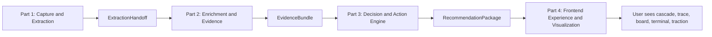
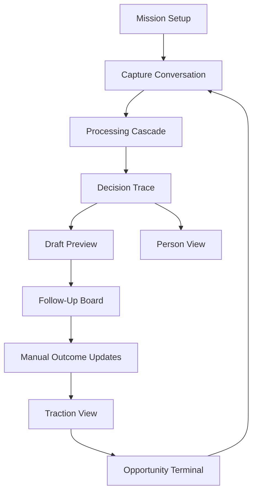
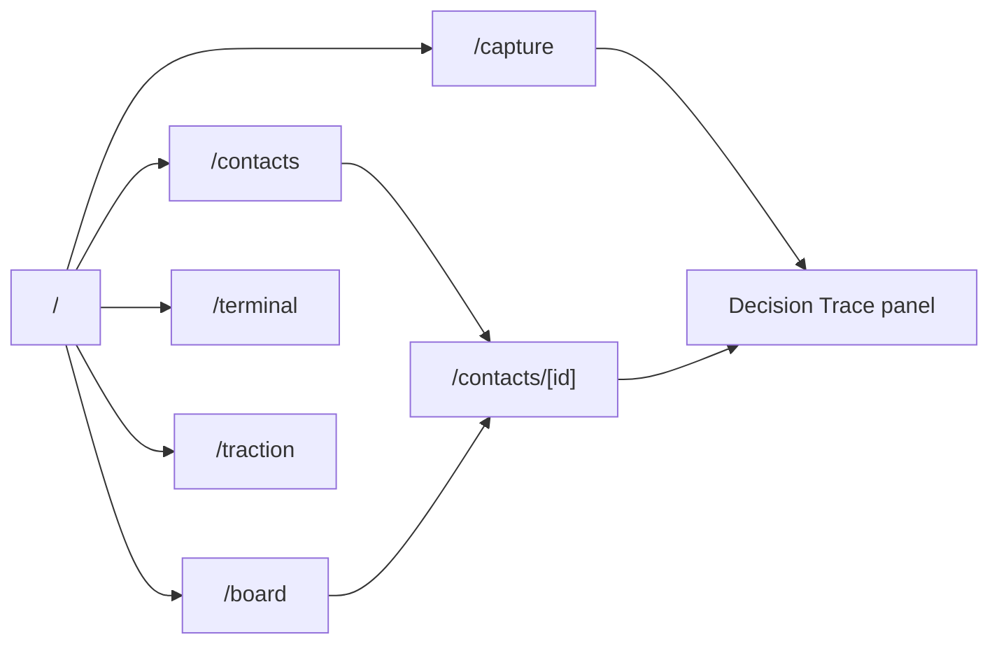
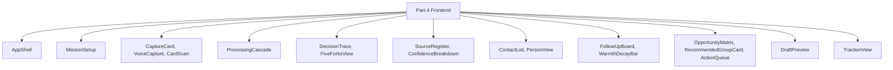
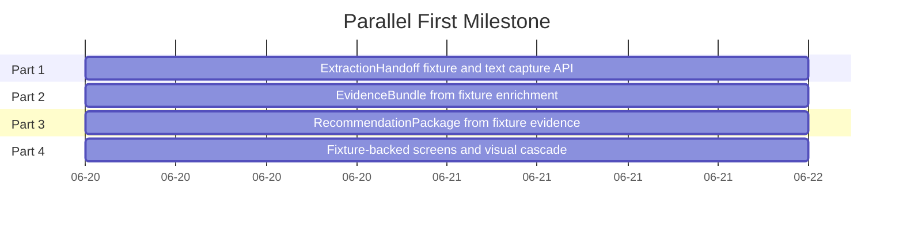

# AfterMeet Intelligence Layer - Visualization Map

## Workstream Flow

## User Experience Flow

## Screen Map

## Contract-to-Screen Map

| Contract | Screen or Component | Owner |
| --- | --- | --- |
| `UserObjectiveProfile` | Mission setup, app shell, terminal | Part 4 consumes, Part 1 produces |
| `ProcessStageEvent` | Processing cascade | Part 4 consumes, Part 1 streams |
| `ExtractionHandoff` | Fixture replay, debug visualization | Part 4 consumes, Part 1 produces |
| `EvidenceBundle` | Person view, source register, confidence display | Part 4 consumes, Part 2 produces |
| `RecommendationPackage` | Decision trace, draft preview, board card | Part 4 consumes, Part 3 produces |
| `FrontendMockDataset` | Fixture-backed demo | Part 4 owns |

## Component Ownership

## Parallel Build Picture

